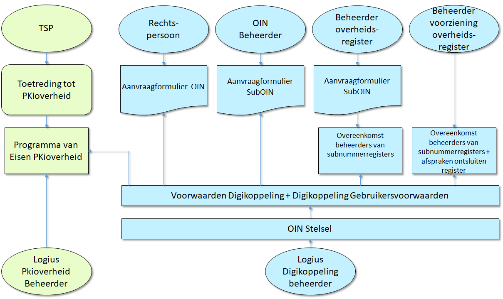

# Inleiding

Het SubOINs stelsel
---------------

In dit document beschrijven we het doel en de werking van het SubOINs Stelsel. Het SubOINs is gestart als een noodzakelijk onderdeel van de Digikoppeling Standaard en is inmiddels een veel gebruikt identificatienummer binnen en zeker ook buíten Digikoppeling. De regels van uitgifte en gebruik van het SubOINs staan beschreven in de *Voorwaarden Digikoppeling* en de *Gebruiksvoorwaarden Digikoppeling*. Daarnaast geeft Logius SubOINs’s en SubOINs uit en slaat de informatie hiervan op in het SubOINs register en ontsluit die met de *COR*, de Centrale SubOINs Raadpleegvoorziening. Dit geheel van regels en uitvoering noemen we het *SubOINs stelsel*.

Waarom dit document 
---------------------

De Voorwaarden Digikoppeling en de Digikoppeling Gebruiksvoorwaarden hebben een juridisch karakter en beantwoorden waarschijnlijk niet elke vraag van gebruikers van een SubOINs. In dit document proberen we daarom de werking van het SubOINs stelsel met al haar facetten nader te beschrijven in de hoop die vragen te beantwoorden.

Aanleiding voor een nieuwe versie van dit document
--------------------------------------------------

Dit document is een update op een versie die Logius in 2016 heeft uitgebracht. De aanleiding was toen een inventarisatie van een aantal inmiddels gegroeide knelpunten met voorstellen voor de wijzigingen van de regels voor gebruik en uitgifte van SubOINs’s en SubOINs. Het document stond aan de basis voor de wijzigingen die in 2017 doorgevoerd.

In 2020 wil Logius de SubOINs regels opnieuw op punten aanpassen. Dit was meteen een mooie gelegenheid om het document bij te werken en in lijn te brengen met zowel de wijzigingen uit 2017 en de (nog te accorderen) wijzigingen van 2020.

Doel en scope van document
--------------------------

Dit document beschrijft het SubOINs-stelsel. Het SubOINs-stelsel bestaat uit de volgende bouwstenen:

- SubOINs- en SubOINs systematiek

- Centrale SubOINs Raadpleegvoorziening (incl. SubOINs-register)

- Toelichting op de juridische voorwaarden en overeenkomsten

Historie van het SubOINs (en vooruitblik)
-------------------------------------

Bij de ontwikkeling van de Digikoppeling standaard in 2006 is besloten om de identificatie in de standaard te baseren op een uniek identificerend nummer van een overheidsorganisatie. [bron document "Evaluatie SubOINs uitgiftev2", 2010]

De behoefte aan een identificatienummer ontstond om een aantal redenen:

- Identificatie op basis van een nummer in plaats van een naam. Namen zijn moeilijk eenduidig te krijgen, door verschillende spellingen, afkortingen en hoofdletters;

- Stroomlijning en standaardisatie van identiteiten en autorisatie. Het was gewenst om *overheidsbreed* eensluidende afspraken te maken over niveaus van autorisatie en dus niveaus van identiteit;

[bron document "SubOINs alternatieven3", 2011]

### SubOINs en PKIoverheid

Het nummer werd opgenomen in het PKIoverheidcertificaat - als inhoud van het attribuut Subject.serialNumber -  en werd daarnaast gebruik in de adressering van berichten.

### Overheids Identifcatienummer

Dit unieke nummer werd het SubOINs, het *Overheidsorganisatie Identificatie Nummer*. De KvK - beheerder van het Handelsregister (HR) - adviseerde om het nummer op het FI-nummer te baseren. In het Handelsregister waren echter in die tijd echter niet alle overheidsorganisaties opgenomen die in het kader van de elektronische overheid van belang waren. Zo hadden allerlei zelfstandige onderdelen van een ministerie, zoals de Belastingdienst en Douane, geen eigen FI-nummer. Voor het gebruik van Digikoppeling was echter afgesproken dat een organisaties én onderdelen van organisaties die berichten willen uitwisselen met een andere overheid, en daartoe zelfstandig contracten afsluiten, een identificerend nummer moeten krijgen, ook als dat onderdeel niet beschikt over een eigen FI-nummer. Afgesproken werd dat Logius het SubOINs ging uitdelen. Op termijn zou dan mogelijk altijd met een FI-nummer gewerkt kunnen worden, wanneer al die zelfstandige onderdelen ook in het Handelsregister zouden worden opgenomen. [bron document "Evaluatie SubOINs uitgiftev2", 2010] 

### SubOINs en HRN

Ook voor private organisatie was een nummer noodzakelijk voor digitale gegevensuitwisseling met de overheid. Het SubOINs stond toen nog voor
*Overheids*identificatienummer en liet niet toe dat ook deze partijen zich inschreven in het SubOINs register. Logius heeft daarom met de certificaatuitgevers aparte afspraken gemaakt om in het verplicht te gebruiken PKIoverheidcertificaat een nummer te laten opnemen volgens de structuur van het SubOINs.  Voor een private organisatie werd niet het RSIN gebruikt. maar haar KvKnummer.  Dit nummer kreeg de naam Handelsregisternummer (HRN).

In 2010 werd door de KvK door een wetswijziging het nieuwe Handelsregister in gebruik genomen, waarin meer overheidsorganen, zoals de ministeries, ingeschreven konden worden. Het door Logius onderhouden SubOINs register bleef daarnaast bestaan. Het register bevatte inmiddels naast in het HR ingeschreven organisatie ook registraties van organisatie-onderdelen en voorzieningen en overheidsorganisaties die zich niet kunnen inschrijven in het HR. In 2014 is een publiektoegankelijk website gelanceerd waarin iedereen het SubOINs van een organisatie kon opzoeken. 

### Aanpassing SubOINs regels in 2016

In 2016 zijn na brede afstemming met gebruikers de regels verduidelijkt wie in aanmerking kwam voor een SubOINs en SubOINs.  De onderbouwing van de regels zijn vastgelegd in het document [SubOINs stelsel v1](#inleiding). De spelregels van het SubOINs zijn vastgelegd in de [Voorwaarden Digikoppeling](https://docs.logius.nl/display/CVS/200421++Voorwaarden+digikoppeling+v1.09) en [Gebruiksvoorwaarden Digikoppeling](https://docs.logius.nl/display/CVS/200421+Gebruiksvoorwaarden+Digikoppeling+v1.09).
Sinds de wijziging van 2016 staat de afkorting voor SubOINs voor *Organisatie* Identificatienummer.

### Doorontwikkeling COR

Logius heeft sinds 2017 een aantal wijzigingen doorgevoerd in de ontsluiting van het SubOINs register:

- in 2017 werd de SubOINs website hernoemd in en uitgebreid naar de Centrale SubOINs Raadpleegvoorziening (COR). De COR toont op de website naast de SubOINs's ook de (Hoofd)SubOINs-houder indien die aanwezig is.

- De aanduiding of de vermelde SubOINs voor eFacturatie gebruikt kon worden is verwijderd, op verzoek van Logius;

- in 2018 is op verzoek van een aantal organisaties een RESTful API toegevoegd waarmee het SubOINs register online bevraagd kan worden. De website bleef ongewijzigd;

- in 2019 is aan het SubOINs register een aantal identificerende nummers toegevoegd, de BG codes voor gemeente en de CBS codes voor Waterschappen en Provincies. Deze gegevens zijn enkel voor de API opvraagbaar.

### Nieuwe voorstellen in 2020

- in 2020 dient Logius een voorstel in dat mogelijk maakt dat *privaatrechtelijke partijen met een publieke taak*  en *privaatrechtelijke partijen ten behoeve van (SAAS-)dienstverlening* aan hun publieke klanten SubOINs’s kunnen aanvragen.

- in 2020 wordt voor het UZI register prefix '00000009' gereserveerd

## Leeswijzer

De de structuur van dit document is gebaseerd op de TOGAF standaard - TOgaf staat voor The Open Group Architecture Framework- .

|Hoofdstuk|Inhoud|
|---|---|
|Architectuurvisie| beschrjft op hoofdlijnen het doel en de kaders van het SubOINs|
|Businessarchitectuur| beschrijft de wijzingen en de rollen in het SubOINs|
|ApplicatieArchitectuur| beschrijft de functies van de COR|
|Het beheer van SubOINs in de COR|Een apart hoofdstuk over uitgifte en beheer van SubOINs|
|Data Architectuur|beschrijft de structuur van het SubOINs en SubOINs|
|Technologie-Architectuur| geeft een technische beschrijving van de COR en de hieraan gekoppelde systemen en bronnen|
|bijlage A|Begrippenlijst|

# Architectuurvisie

Doel SubOINs
--------

Het organisatie-identificatienummer (SubOINs) is het identificatienummer voor niet-natuurlijke personen ten behoeve van het digitale berichtenverkeer met de overheid. De toekenning van het SubOINs is gebaseerd op identificatie van de aanvrager van het SubOINs middels het Handelsregister dan wel een ander aangesloten overheidsregister.

## Inleiding

Het Organisatie-identificatienummer (SubOINs), voorheen Overheidsidentificatienummer, is onderdeel van de Digikoppeling standaard. De standaard wordt gebruikt in elektronische berichtuitwisseling met en door de overheid. Het SubOINs is een twintigcijferig nummer dat een organisatie identificeert in het digitale berichtenverkeer. Digikoppeling verplicht de opname van het SubOINs in het PKIoverheid certificaat zodat systemen kunnen worden geïdentificeerd en geauthenticeerd. Daarmee is het SubOINs een randvoorwaarde voor veilig digitaal verkeer.

Een groot aantal voorzieningen van de digitale overheid maakt gebruik van het SubOINs. Dat gebeurt op verschillende manieren en met verschillende doeleinden: de identificatie, authenticatie en autorisatie van organisaties of organisatieonderdelen, en de routering van berichten naar organisaties,organisatieonderdelen of voorzieningen.

Gebruik van het SubOINs
-------------------

Het SubOINs-nummer wordt als identificerend nummer gebruikt in PKIoverheidcertificaten (authenticatie), in de adressering en routering van berichten, en in autorisatietabellen. Organisaties mogen het SubOINs of SubOINs gebruiken voor identificatie van organisaties en organisatieonderdelen in het digitaal verkeer. Het overig gebruik van het SubOINs of SubOINs betreft:

- Authenticatie

- Autorisatie

- Adressering

- Routering

| **Functie**| **Definitie**| **Toelichting functie SubOINs** |
|------------------------------------------------------------------------------|------------------------------------------------------------------------------------------------------------------------------------------------------------------------------------------------------------------------------------------------------------------|-------------------------------------------------------------------------------------------------------------------------------------------------------------------------------------------------------------------------------------------------------------------------------------------------------------------------------------------------------|
| [Identificatie (Identificeren)](http://www.noraonline.nl/wiki/Identificatie) | Het bekend maken van de identiteit van personen, organisaties of IT-voorzieningen. (Bron: *NORA 3.0 Principes voor samenwerking en dienstverlening)* | Het SubOINs of SubOINs is het identificerende nummer voor organisaties t.b.v. digitaal verkeer met de overheid.|
| [Authenticatie (Authenticeren)](http://www.noraonline.nl/wiki/Authenticatie) | Het aantonen dat degene die zich identificeert ook daadwerkelijk degene is die zich als zodanig voorgeeft: ben je het ook echt? Authenticatie noemt men ook wel verificatie van de identiteit. (Bron: *NORA 3.0 Principes voor samenwerking en dienstverlening)* | Het SubOINs of SubOINs wordt opgenomen in het subject serialNumber veld van het PKIoverheid certificaat. |
| [Autorisatie (Autoriseren)](http://www.noraonline.nl/wiki/Authenticatie) | Het proces van het toekennen van rechten voor de toegang tot geautomatiseerde functies en/of gegevens in ICT voorzieningen.| Het feit dat een organisatie over een SubOINs of SubOINs beschikt zegt niets over enige autorisatie op gegevens of informatie. Dit is voorbehouden aan de verstrekkende partij die dit zelf beoordeelt. Partijen die voorzieningen aanbieden kunnen zelf autorisatielijsten bijhouden waarin het SubOINs van geautoriseerde organisaties kan worden opgenomen. |
| **Adresseren** | Het aangeven van de ontvangende partij (en de verzendende partij) in het bericht.| Digikoppeling schrijft b.v. voor dat het SubOINs of SubOINs wordt gebruikt in de header voor adressering.|
| **Routeren** | Het doorsturen van een bericht aan de geadresseerde partij bijvoorbeeld via een routeringsregel of tabel.| Routering vertaalt het logische adres – het SubOINs of SubOINs – naar een fysiek endpSubOINst (url). |

Context Centrale SubOINs Raadpleegvoorziening (COR)
-----------------------------------------------

In onderstaand diagram wordt de relatie tussen COR met de omgeving weergegeven.

 
*Figuur 1 Context diagram SubOINs-raadpleegvoorziening en SubOINs spelregels*

Kaders en bronnen
-----------------

De volgende kaders en bronnen zijn gehanteerd bij de uitwerking van het SubOINs-stelsel:

- NORA is het kader voor de uitwerking van de Centrale SubOINs Raadpleegvoorziening.

- Memo SubOINs: *Gebruik van SubOINs, knelpunten en oplossingen Het memo met opleggers zijn op aangeboden aan de Regieraad Gegevens van 14 januari 2016. De stukken
zijn schriftelijk besproken. De stukken zijn te vinden op* <https://digitaleoverheid.pleio.nl/file/group/30207952/all#41536872>

- *200421 Voorwaarden Digikoppeling v1.09.docx:* conceptversie metwijzigingsvoorstellen voor verruiming van het beleid van SubOINs uitgifte
voor afnemers.

- 200421 Gebruiksvoorwaarden Digikoppeling v1.09 conceptversie met wijzigingsvoorstellen voor verruiming van het beleid van SubOINs uitgifte
voor gebruikers.

# Businessarchitectuur

Wat is het SubOINs 
---------------

Het Organisatie-identificatienummer (SubOINs) is een uniek nummer dat Logius kan toekennen aan organisaties om zich te kunnen identificeren, authentiseren en of autoriseren bij digitaal berichtenverkeer binnen en met de overheid.

Voor wie is het SubOINs 
--------------------

Het SubOINs is voor organisaties die berichten uitwisselen met de overheid. Dit kunnen publieke en private organisaties zijn. Voorwaarde is dat zij staan ingeschreven in het handelsregister. Daarnaast kunnen ook een aantal organisaties die niet in het handelsregister zijn opgenomen een SubOINs aanvragen. Dit zijn bijzondere organisaties met een publieke taak, colleges van advies en internationale organisaties met een rechtspersoonlijkheid.

Het SubOINs maakt een onderscheid in gebruikers en afnemers. Beiden kunnen het SubOINs aanvragen. Deze begrippen komen uit de *Algemene Voorwaarden Logius voor afnemers* en zijn als volgt gedefenieerd

- Afnemer: een publiekrechtelijke of privaatrechtelijke organisatie, ofcollege of een persoon met een publieke taak of bevoegdheid, die voor de uitoefening van die publieke taak elektronisch verkeer met andere overheden en burgers en/of bedrijven wenselijk acht en daarbij gebruik kan en mag maken van één of meer Diensten van Logius.

- Gebruiker: een overheidsorganisatie of; onderneming of een rechtspersoon, die is ingeschreven in het Handelsregister of; natuurlijk persoon die is ingeschreven in de Gemeentelijke Basisadministratie persoonsgegevens (GBA), en in deze hoedanigheid gebruik maakt van de Diensten van Logius ten behoeve van het elektronisch verkeer met één of meerdere Afnemers.

Op welke manier kan een organisatie een SubOINs verkrijgen
-------------------------------------------------------

Bedrijven en privaatrechtelijke instellingen die digitaal communiceren met de overheid hebben daarvoor in veel gevallen een identificerend nummer nodig. Dit identificerende nummer kan op twee manieren verkregen worden:

1. Bij Logius: Door een SubOINs (Organisatie Identificatie Nummer) aan te vragen bij Logius via een aanvraagformulier op Logius.nl. Het SubOINs wordt afgeleidvan het KvK-nummer uit het Handelsregister. Het SubOINs wordt vastgelegd in een register dat publiek raadpleegbaar is via de centrale SubOINs Raadpleegvoorziening (<https://portaal.digikoppeling.nl/registers/>) via een website en een API. De regels uit de Gebruiksvoorwaarden Digikoppeling zijn van toepassing. Er zijn geen kosten verbonden aan deze registratie.

2. Bij de TSP: Bij de aanvraag van een PKIoverheid-certificaat zal de Trust Service Provider (TSP), bij ontbreken van een SubOINs, het identificerend nummer bij de creatie van het certificaat zelf afleiden op basis van het KvK-nummer uit het Handelsregister op gelijke wijze als bij de afleiding van het SubOINs. Er vindt echter geen publiek raadpleegbare registratie plaats. Voor de werking van het dataverkeer met de overheid is er verder geen verschil.

Wat is een SubOINs
------------------

Het SubOINs is een afgeleide van het SubOINs, volgens dezelfde nummersystemathiek, voor die onderdelen van de organisatie die geen rechtspersoon zijn maar wel een uniek inditificatinummer behoeven voor digitale communicatie met de overheid. Juridisch zijn die organisatieonderdelen altijd onderdeel van de organisatie die het bovenliggende SubOINs heeft verkregen.

Voor wie is het SubOINs
-----------------------

Het SubOINs is aan te vragen door organisaties die voor het uitvoeren van een publieke taak behoefte hebben aan een identificerend nummer op het niveau van organisatieonderdelen.

Daarnaast is het SubOINs aan te vragen door partijen die als onderdeel van hun dienstverlening aan overheden (of publieke organisaties) een uniek
identificerend nummer nodig hebben en het SubOINs nummer hiervoor niet kunnen gebruiken.

Wijzigingen in het SubOINs Stelsel sinds 2006 
------------------------------------------

Sinds het onstaan van het SubOINs is een aantal wijzigingen doorgevoerd in de toekenning en het gebruik van het SubOINs. De belangrijkste wijzingen geven we hieronder weer:

In 2017 zijn - naast duidelijker uitgeschreven juridische kaders- de volgende aanpassingen in de SubOINs regels uitgevoerd:

- de mogelijkheid voor organisaties met publieke rechtspersoonlijkheid om SubOINs’s aan te vragen voor aan hen gerelateerde organisatieonderdelen, voorzieningen en samenwerkingsverbanden

- de mogelijkheid voor houders van sectorregistraties om op te gaan treden als SubOINs-beheerder en op die manier door hen geregistreerde organisaties die geen eigen (Nederlandse) rechtspersoonlijkheid bezitten ook van SubOINs’s te voorzien.Voor identificatie

- private partijen, die staan geregistreerd bij de KvK, krijgen de mogelijkheid om zich ook te laten registreren in de COR waarbij er een SubOINs
afgeleid wordt van het KvK-nummer toegekend en de organisatiegegevens vanuit het Handelsregister worden overgenomen.

- Met het doorvoeren van het nieuwe beleid is het begrip SubOINs van *Overheids* IdentificatieNummer gewijzigd naar *Organisatie* IdentificatieNummer.

In 2017 verving de COR het toenmalige SubOINs register. Aan de COR werden de volgende nieuwe functionaliteiten toegevoegd:

- De relatie tussen SubOINs’s en de verantwoordelijke rechtspersoon kan in de COR worden vastgelegd en wordt publiekelijk getoond bij raadpleging van de voorziening.

- De mogelijkheid tot aanmaak, wijziging en intrekking van SubOINs’s door beheerders is toegevoegd.

- Beheerders hebben de mogelijk gekregen om de organisatiegegevens behorend bij een SubOINs rechtstreeks vanuit het Handelsregister via de KVK-API op tevragen en in de COR over te nemen waarmee de kwaliteit van geregistreerde gegevens kan worden verhoogd zonder extra benodigde handmatige handelingen.

- De exportfunctionaliteit waarmee de inhoud van de COR-database in CSV-formaat kan worden gedownload is publiek beschikbaar gemaakt.

- Beheerders hebben de mogelijkheid gekregen om de relatie met een SubOINs van de ene rechtspersoon naar een andere rechtspersoon over te dragen. Dit komt van pas als er een organisatieonderdeel of voorziening overgaat van de ene instantie naar een andere.

- Het al dan niet kunnen gebruiken van (Sub)SubOINs’s voor e-facturatie wordt publiekelijk getoond.

- Niet alleen actieve (Sub)SubOINs’s maar ook ingetrokken (Sub)SubOINs’s worden publiekelijk getoond.

- Er is een voorziening aangebracht waarmee het aantal bevragingen van de COR kan worden gerapporteerd

De COR is sinds de lancering steeds verder doorontwikkeld en aangepast;

- het eFacturatie kenmerk wordt niet meer getoond in de COR. Deze informatie over is nu te vinden op [https://www.logius.nl/diensten/e-factureren](https://www.logius.nl/diensten/e-factureren)

- Restful API op de COR: de COR API biedt verschillende mogelijkheden om het SubOINs register te bevragen

- extra identificerende codes toegevoegd aan het SubOINs register. Hierdoor is het mogelijk om via de COR API de vertaling te maken van SubOINs naar Gemeentecode en omgekeerd. Naast Gemeentecode kan een vertaling worden opgevraagd naar Provincie-, Waterschap- of Ministeriecode

Het gebruik van het SubOINs neemt steeds meer toe. Hierdoor zijn nieuwe knelpuntenin de praktijkonstaanwaarbij de SubOINs spelregels knelden met de behoefte en noden van organisaties.

In 2020 legt Logius een aantal wijzigingsvoorstellen in de SubOINs spelregels aan de Digikoppeling Community. De nieuwe spelregels
zijn verwerkt in de aange[aste *Voorwaarden Digikoppeling* en *Gebruiksvoorwaarden Digikoppeling*.

Belangrijkste wijzigingen 

- Private partijen met een publieke taak kunnen SubOINs’s kunnen aanvragen;

- Private partijen kunnen ten behoeve van (SAAS-)dienstverlening aan hun publieke klanten SubOINs’s aanvragen

Daarnaast zijn de Voorwaarden verduidelijkt en up-to-date gebracht. Voor het SubOINs gaat het om de volgende onderdelen:

- Geen vermelding meer tbv e-factureren in de COR

- Vermelding van het gebruik van organisatiecodes in de COR

Rollen in het SubOINs stelsel
-------------------------

### Stakeholders

Stakeholders bij het gebruik van het SubOINs-Stelsel zijn in beginsel alle partijen die gebruik maken van het (sub)SubOINs en/of bijbehorende centrale SubOINs register
(COR) én de partijen die een rol hebben bij het beheer van het SubOINs.

### Opdrachtgever

Het ministerie van BZK (BZK) is opdrachtgever van Logius en eigenaar van het SubOINs-stelsel. Als eigenaar draagt BZK ook verantwoordelijkheid voor toezicht en audits over de centrale voorziening en afspraken.

### Beheerder SubOINs-stelsel

Logius beheert het SubOINs Stelsel. Het SubOINs valt onder de Digikoppeling Standaard. Het Centrum voor Standaarden, van Logius is beheerder van de Digikoppeling standaard en voert ook het beheer over van het SubOINs-stelsel, voorwaarden en overeenkomsten.

### Beheerder COR

Logius beheert de Centrale SubOINs Raadpleegvoorziening (COR). Logius Team Interfaces, onderdeel van het Productiehuis van Logius voert het dagelijks beheer en de doorontwikkeling uit van de COR.  Logius heeft de zorgplicht om de COR online toegankelijk te houden voor de gebruikers van de COR.

### Registerhouder overheidsregister

De registerhouder beheert een overheidsregister en waarborgt de kwaliteit van de te raadplegen nummers en bijbehorende gegevens. Voor elke entiteit die is opgenomen in het overheidsregister is duidelijk wie de verantwoordelijke rechtspersoon is. De verantwoordelijke rechtspersoon is herkenbaar aan de hand van het identificerende nummer (RSIN, KvK nummer of SubOINs). Het register heeft geborgd dat als de rechtspersoon ophoudt te bestaan, de registratie van de entiteit vervalt.

### SubOINs-beheerder

Een overheidsorganisatie kan na invulling van het aansluitformulier en toetsingprocedure door de COR beheerder toegelaten worden alsSubOINs-beheerder. De SubOINs-beheerder draagt zorg voor de registratie van SubOINs voor organisaties die niet in een aangesloten register voorkomen maar die wel bij een broninstantie of op basis van brondocumenten kunnen worden geïdentificeerd en geverifieerd. De SubOINs-beheerder stelt de identificatie van een buitenlandse partij vast aan de hand van bewijsstukken of zelfstandig onderzoek. Een SubOINs-beheerder kan eenSubOINs aanmaken voor specifieke partijen die niet in het Handelsregister staan maar wel identificeerbaar moeten zijn. De
identiteit van de aanvrager moet door de SubOINs-beheerder worden gecontroleerd aan de hand van brondocumenten of andere bronnen. De SubOINs-beheerder kan SubOINs aanmaken en publiceren of intrekken via de COR. De SubOINs-beheerder is verantwoordelijk voor het doorvoeren van mutaties.

### Certificatiedienstverlener (TSP)

De TSP's geven certificaten uit conform de eisen uit het PvE van PKIoverheid.Daarmee zijn zij verantwoordelijk voor de betrouwbaarheid van de genoemde certificaten. De TSP's doen met het oog op het uitgeven van een certificaat onderzoek naar de identiteit van de organisatie en de tekenbevoegdheid *De voorwaarden hiervoor zijn beschreven in het PvE PKIo PvE (deel 3 aanvullende eisen)* van de aanvragers van een certificaat. Tevens controleren zij de identiteit van de aanvrager op grond van een face to face controle. De TSP raadpleegt het SubOINs van de aanvrager via de COR en neemt dit nummer en naam op in het PKIoverheid certificaat.

### SubOINs-houder

De SubOINs-houder is een rechtspersoon met een publieke taak, die gebruik maakt van het SubOINs. Slechts een SubOINs–houder kan een SubOINs aanvragen voor een organisatie, organisatie-onderdeel of voorziening die onder zijn juridische verantwoordelijkheid valt.

### Beheerder PvE PKIoverheid

Logius PKIoverheid is beheerder van het Programma van Eisen van PKIoverheid en toezichthouder op de TSP's.

Juridische structuur
--------------------

Aansluitend op de beschrijving en uitleg van de rollen van betrokken partijen in het vorige hoofdstuk worden de kernbegrippen in de juridische context toegelicht.

Er van uitgaande dat het SubOINs voorlopig geen wettelijke grondslag krijgt zijn de Voorwaarden Digikoppeling en de SubOINs-formulieren de aangewezen plaats om de spelregels voor de betrokken partijen te definiëren. 

### SubOINs-voorwaarden en SubOINs–formulieren

Onderstaand schema beschrijft op welke manier organisaties een SubOINs of SubOINs bij Logius kunnen aanvragen

Figuur 2: Juridische instrumenten (onderdeel van Digikoppeling)

### Identificatie

Het gebruik van een Organisatie Identificatienummer (SubOINs) beoogt rechtspersonen en niet-rechtspersonen te identificeren ten behoeve van digitale
berichtenverkeer met de overheid.

### Handelsregister

Een SubOINs is waar mogelijk afgeleid van bestaande identificerende nummers uit het Handelsregister.

### Rechtspersonen en samenwerkingsverbanden

Rechtspersonen en samenwerkingsverbanden *Dit zijn de samenwerkingsverbanden die zich conform de Hrw in kunnen schrijven in het Handelsregister.* worden ex art.6 Handelsregisterwet (Hrw) ingeschreven in het Handelsregister, en kunnen dus worden geïdentificeerd ten behoeve van het gebruik van het SubOINs. Tevens kunnen de in art. 1:2 Algemene wet bestuursrecht (Awb) omschreven overheidsorganen, die niet in het Handelsregister kunnen worden ingeschreven, een SubOINs verkrijgen.

### Buitenlandse rechtspersonen en organisaties

Buitenlandse rechtspersonen en organisaties die niet ingeschreven kunnen worden in een Nederlands overheidsregister, maar wel voldoen aan de vereisten voor een PKIoverheidscertificaat, kunnen bij een SubOINs-beheerder een aanvraag indienen voor een SubOINs. Na controle door een SubOINs-Beheerder kunnen deze buitenlandse organisaties een SubOINs krijgen.

### SubOINs

Organisaties, organisatieonderdelen en/of voorzieningen die niet in een aangesloten overheidsregister voorkomen, komen mogelijk toch in aanmerking voor een SubOINs. (In enkel bijzondere gevallen ook voor een SubOINs. Het gaat dan om het SubOINs dat wordt toegekend aan een onderdeel van de Staat der Nederlanden). Deze worden geregistreerd in het SubOINs-register. Een SubOINs is een identificerend nummer voor niet-rechtspersonen. Het SubOINs heeft dezelfde structuur als het SubOINs. Een SubOINs is altijd herleidbaar tot een rechtspersoon die is ingeschreven in het Handelsregister en valt onder de juridische verantwoordelijkheid van deze rechtspersoon.

### SubOINs-houder

De SubOINs-houder is een rechtspersoon met een publieke taak die gebruik maakt van het SubOINs. Slechts de SubOINs–houder kan een SubOINs aanvragen voor een organisatie, een organisatieonderdeel of een voorziening die onder zijn juridische verantwoordelijkheid valt. De SubOINs-houder zal zich ervan moeten vergewissen dat hij middels juridische afspraken – zoals bijvoorbeeld statuten, een overeenkomst, een inschrijving in een register en/of een mandaatbesluit – juridische verantwoordelijkheid kan dragen voor het handelen van de organisatie of organisatieonderdeel, die gaat beschikken over een SubOINs Een eis is dat de functionaris, die de aanvraag voor een SubOINs doet, tekenbevoegd is.

De SubOINs–houder heeft een zorgplicht met betrekking tot het handelen door de houder van het SubOINs, voor zover dit handelen betrekking heeft op de elektronische berichtenuitwisseling waarbij gebruik wordt gemaakt van het SubOINs en bijbehorende SubOINs.

### SubOINs op basis van een aangesloten register

Als een organisatie geregistreerd is in een aangesloten register (niet het Handelsregister), dan kan het identificerend nummer uit dit register worden gebruikt als SubOINs. Daarmee is een aangesloten register in feite een register van SubOINs voor een specifieke doelgroep.

### Opnemen SubOINs in PKIoverheidscertificaat

De TSP neemt een SubOINs of SubOINs op in een PKIoverheidscertificaat. Hiervoor wordt het *Subject.serialNumber* veld van het certificaat gebruikt.

 Centrale SubOINs Raadpleegvoorziening (COR)
----------------------------------------

Logius is beheerder van de Centrale SubOINs Raadpleegvoorziening (inclusief het SubOINs-register) in opdracht van BZK. De nieuwe COR heeft niet het karakter van een basisregistratie of een sectorale registratie. De COR is een landelijke voorziening.

Toezicht uitoefenen
-------------------

Logius moet toezien op de naleving van de voorwaarden en de afspraken die partijen met Logius maken.Logius moet voldoen aan de kwaliteitseisen vanuit haar opdrachtgever BZK. Daarbij is de mogelijkheid aanwezig dat BZK onafhankelijke derden, zoals de ADR *Auditdienst Rijk*, inschakelt om controles uit te voeren. Daarmee is de functiescheiding gewaarborgd.

### Naleving Voorwaarden SubOINs

De beheerder van het SubOINs-stelsel controleert op basis van signalen en steekproefsgewijs de naleving van de SubOINs-voorwaarden en de ondertekende
aanvraagformulieren met de SubOINs–houders, die SubOINs uitgeven.

### Naleving overeenkomsten

De beheerder van het SubOINs-stelsel controleert de naleving van de overeenkomsten, af te sluiten met de SubOINs-beheerders en met de registratiehouders.

### Toezicht BZK

De opdrachtgever BZK beoordeelt binnen het regulier toezicht op de beheerder van het SubOINs-stelsel in hoeverre de SubOINs-voorwaarden en overeenkomsten nageleefd worden door de betrokken contractspartijen.

Internationale uitwisselingen
-----------------------------

Voor internationale uitwisselingen is alleen het gebruik van het SubOINs niet voldoende. Er ontbreken dan twee elementen die in internationaal verband nodig zijn:

1.Volgens de ISO 6523 part 1 standaard is een ICD code nodig. Het SubOINs is sinds 2018 opgenomen in de ICD lijst

2.Voor gebruik binnen de EU wordt een EU ID verplicht. Dit EU ID onderkent een landcode; de impact van het EU ID moet nog worden onderzocht.

De volgende alinea's geven achtergrondinformatie over de ISO 6523 standaard, het EU ID.

### Mapping naar de ISO 6523 standaard

Het SubOINs is aangemeld en opgenomen in in ICD Codelist: [https://docs.peppol.eu/poacc/billing/3.0/codelist/ICD/](https://docs.peppol.eu/poacc/billing/3.0/codelist/ICD/)
Het SubOINs is geregistreerd onder *code id 0190* met de volgende beschrijving

>Organisatie Indentificatie Nummer (SubOINs)
>
> The SubOINs is part of the Dutch standard ‘Digikoppeling’ and is used for identifying the organisations that take part in electronic message exchange with the Dutch Government. The SubOINs must also be included in the PKIo certificate.

# Applicatie-architectuur

Gebruik van de Centrale SubOINs Raadpleegvoorziening
------------------------------------------------

Het SubOINs van een rechtspersoon is publiek raadpleegbaar via de Centrale SubOINs Raadpleegvoorziening (COR). De COR registreert organisaties en stelt het SubOINs samen op basis van de SubOINs-systematiek (zie bijlage A). Voor de registratie baseert de COR gebruikt zich waar mogelijk op registers met een wettelijke of formele taak, zoals het Handelsregister en het FI register. De gebruiker kan in de COR zoeken op nummer of naam. De zoekresultaten worden aan de gebruiker getoond. 

De COR is sinds 2017 als publiek toegankelijke voorzienig beschikbaar.

De COR bestaat uit de volgende kern-onderdelen:

- Een publiek toegankelijk raadpleegvoorziening.

- Een webservice die een Restful API aanbiedt

- Een beheermodule waarmee Logius beheerders de COR content bijhouden.

Publieke raadpleegvoorziening
-----------------------------

De COR biedt de volgende services voor gebruikers:

- Online zoeken naar SubOINs en SubOINs op basis van nummers, organisatienamen ofdelen ervan

- REstful API functionaliteit

- Export van alle geregistreerde organisaties in CSV formaat

Beheerfuncties
--------------

De COR biedt, naast bovenstaande, de volgende services voor beheerders:

- Detailinformatie over de geregistreerde organisaties en een bewerkmogelijkheid om deze informatie aan te passen

- Historie/audittrail van alle doorgevoerde wijzigingen per registratie

- Mogelijkheid om nieuwe SubOINs- en SubOINs-registraties toe te voegen

- Mogelijkheid om actieve SubOINs en SubOINs in te trekken

- Data synchronisatie tussen de COR database en het Handelsregister. zowel bij invoer van nieuwe registraties als periodiek, om bestaande registraties te verifiëren

- Lifecycle management van SubOINs

- Gebruikersbeheer

Algemene eisen aan de Centrale SubOINs Raadpleegvoorziening
-------------------------------------------------------

De Centrale SubOINs Raadpleegvoorziening voldoet aan de volgende eisen:

- De authenticatie van beheerders verloopt via een beveiligd authenticatiemiddel.

- Er is een systeemcontrole die voorkomt dat er duplicaten van SubOINs's of SubOINs ontstaan.

- Er is een systematiek(algoritme) voor het genereren van een uniek nummer die gaat dienen als SubOINs.

- De beheerder treft passende beveiligingsmaatregelen om de privacy van de verwerking van persoonsgegevens te waarborgen, zoals de Logiusbeveiligingsrichtlijnen (ISO27000-1 en ISO 27000-2) en IB policies.

- Maakt gebruik van Nederlandse API Design Rules voor webservice.

- Voorziet in een audittrail van mutaties op een registratie.

- Voorziet in management rapportages die inzicht bieden in aantallen SubOINs, gebruikers, activiteiten SubOINs-houders enzovoort.

- Voldoet aan Digitoegankelijk

- Volgt de principes en kaders van NORA.

- Voldoet aan de eisen die gesteld worden door de beheerders van overheidsregisters.

Centrale SubOINs Raadpleegvoorziening (COR)
---------------------------------------

### Onderdelen van de COR

De COR bestaat uit een publiek toegankelijk gedeelte en een besloten gedeelte. Het publiek toegankelijke deel wordt ontsloten door een website en een webservice met een Restful API.

### Toegang tot het besloten gedeelte van de COR

Enkel daarvoor aangewezen medewerkers van Logius hebben toegang tot het besloten gedeelte van de COR.

### Registratie in het besloten gedeelte van de COR

De beheerder van de COR registreert in het besloten gedeelte van de COR:

- Het uitgeven van een nieuw SubOINs.

- Het intrekken van een bestaand SubOINs.

- Het verlengen van de geldigheidsdatum van een SubOINs

- Het verlengen van SubOINs die was ingetrokken na de standaard geldigheidsduur

- Wijzigingen in de registratie van organisatie(onderdelen) of voorzieningen.

### Publiceren van SubOINs en SubOINs

Het SubOINs of SubOINs is pas openbaar toegankelijk, nadat de beheerder het SubOINs heeft gepubliceerd. Het SubOINs of SubOINs bezit dan de status *Actief*. De COR vermeldt ook SubOINs en SubOINss die ingetrokken zijn.

### Aansluiten COR op overheidsregisters

De beheerder van het SubOINs-stelsel bepaalt welke overheidsregisters onderdeel uitmaken van de SubOINs-systematiek. De beheerder van het SubOINs-stelsel maakt afspraken over het gebruik van deze registers met de registratiehouders. De registratiehouders zijn verantwoordelijk voor de kwaliteit van gegevens en voor de beschikbaarheid van het register.

### Gebruik van de COR API

De COR API is publiek beschikbaar voor systemen. De beheerder van de COR kan de toegang reguleren, bijvoorbeeld door het verstrekken van zogenaamde API-keys, of door gebruik te maken van tweezijdig TLS.

### Privacybescherming en informatiebeveiliging

De beheerder van de COR is verantwoordelijk voor de privacybescherming van persoonsgegevens in de COR en de informatiebeveiliging met betrekking tot de COR, en komt derhalve de van toepassingzijnde wet – en regelgeving na.

### Kwaliteitsborging

De beheerder van de COR is verantwoordelijk voor het technisch functioneren van de COR en voor het bieden van ondersteuning bij het gebruik van de COR. De beheerder van de COR zorgt voor de beschikbaarheid van het systeem. Deze afspraken worden vastgelegd in een Service Level Agreement.De beheerder van de COR is niet verantwoordelijk voor de kwaliteit van de SubOINs. De rechtspersonen die de SubOINs uitgeven hebben een zorgplicht met betrekking tot de inhoud van de geregistreerde gegevens in de COR. Bij twijfel over de juistheid van geregistreerde gegevens kan de beheerder van de COR maatregelen nemen om de kwaliteit van subnummer registraties te toetsen en desgewenst te herstellen. De beheerder van de COR is niet verantwoordelijk voor de kwaliteit van de gegevens uit de aangesloten overheidsregisters.

# Het beheer van SubOINs in de COR

SubOINs: uitgifte
------------------

### Regels voor uitgifte SubOINs

**Aanmaken SubOINs**

Een rechtspersoon, die SubOINs–houder is, kan een SubOINs aanvragen voor een entiteit zonder rechtspersoonlijkheid - te weten een organisatie, organisatieonderdeel of voorziening - waarvoor hij de juridische verantwoordelijkheid neemt voor het gebruik van SubOINs. De SubOINs worden beheerd in het *SubOINs-register*, onderdeel van de COR. Onder de definitie van een entiteit vallen ook diensten zoals (landelijke) voorzieningen, mits deze als een onderdeel van een organisatie beschouwd kunnen worden en geïdentificeerd moeten worden voor informatie-uitwisseling. Logius maakt op verzoek van een SubOINs-houders SubOINs aan in de COR.

Organisaties in andere registers dan het Handelsregister

Organisaties die geregistreerd staan in andere aangesloten registers dan het Handelsregister worden beschouwd als houders van een SubOINs. Voor deze organisaties gelden dezelfde regels als houders van SubOINs die door rechtspersonen zijn aangemaakt.

### Aanvragen PKIoverheidscertificaat

De SubOINs–houder vraagt een PKIoverheidscertificaat aan ten behoeve van identificatie/authenticatie, signing of encryptie. De TSP verstrekt het PKIoverheidcertificaat aan de houder van het SubOINs. Als een PKI Overheid certificaat wordt aangevraagd door de SubOINs-houder ten behoeve van een SubOINs-houder, dan neemt de TSP daarin het SubOINs op en de bijbehorende naam uit het SubOINs-register.

### Samenwerkingsverbanden

Een deelnemer binnen een (publiek) samenwerkingsverband zonder rechtspersoonlijkheid mag een SubOINs uitgeven aan het samenwerkingsverband, mits de betreffende deelnemer SubOINs-houder is. De deelnemers dienen onderling te borgen dat de aanvrager is gemandateerd om een aanvraag te doen namens de overige deelnemers.

SubOINs: beheer
----------------

### Mutaties doorgeven aan de COR

De SubOINs–houder moet alle mutaties met betrekking tot de SubOINs doorgeven aan Logius, beheerder van de COR.

### Intrekkingsplicht

De SubOINs–houder is verplicht een SubOINs in te trekken in de COR, indien het voor frauduleus handelen kan worden of wordt gebruikt, of de betreffende organisatie of organisatieonderdeel ophoudt te bestaan of overgaat naar een andere organisatie of rechtspersoon. Daarnaast beschikken de SubOINs-beheerders en Logius over de bevoegdheid tot het intrekken van SubOINs.

### Beheerder van een overheidsregister

De beheerder van een overheidsregister borgt dat wijzigingen worden gecontroleerd en worden doorgevoerd zodat een SubOINs alleen kan worden gebruikt zolang de registratie in het overheidsregister geldig is en de rechtspersoon bestaat. Het SubOINs van de entiteit is altijd herleidbaar tot de juridisch verantwoordelijke rechtspersoon.

SubOINs: geldigheidsduur en bewaartermijnen
--------------------------------------------

### Geldigheidsduur

De door de SubOINs-houder uitgegeven SubOINs hebben een geldigheidsduur van drie jaar. SubOINs kunnen worden verlengd door de SubOINs-houder via een verzoek aan Logius.

### Beëindigen

Als het KvK-nummer of RSIN vervalt, vervalt het SubOINs. Als het SubOINs vervalt, mogen de daaraan gerelateerde SubOINs niet meer worden gebruikt, en moeten deze worden ingetrokken.

SubOINs: Aanvraagformulieren
-------------------

De SubOINs–houder die SubOINs aanvraagt voor organisatie(s) of organisatieonderdelen, zal het aanvraagformulier moeten invullen en ondertekenen. Daarop zijn ook de Voorwaarden Digikoppeling en/of de Gebruiksvoorwaarden van toepassing. De spelregels uit dit document worden opgenomen binnen de aan te passen voorwaarden.De SubOINs–houder verklaart zich op het formulier juridisch verantwoordelijk voor het gebruik van het SubOINs door de houder van het SubOINs. 

SubOINs: samenstelling en raadpleging
---------------------------------

Het SubOINs wordt samengesteld op basis van een inschrijving in het Handelsregister of ander (op de COR) aangesloten overheidsregister. Organisaties die geregistreerd staan in een ander aangesloten register beschikken daarmee over een SubOINs. Het SubOINs kan publiekelijk worden geraadpleegd via de COR. De COR raadpleegt de aangesloten overheidsregisters en stelt het SubOINs samen op basis van de SubOINs-systematiek zoals beschreven in bijlage A.

### Registerhouders van overheidsregisters

Logius maakt afspraken met registerhouders over het gebruik van overheidsregisters ten behoeve van het kunnen raadplegen van deze registers via
de COR.Registers kunnen worden aangesloten op het SubOINs-stelsel indien ze voldoen aan de volgende voorwaarden:

- Er is een juridische grondslag voor het register.

- Er is een beheerder die het inhoudelijk en technisch beheer voert.

- De beheerder controleert de identiteit van de rechtspersoon aan de hand van
het Handelsregister.

- Het identificerende nummer is gekoppeld aan een rechtspersoon.

- Het overheidsregister is publiek raadpleegbaar.

- Er is een webservice beschikbaar.

# Data Architectuur

Prefix tabel
------------

Een aangesloten overheidsregister krijgt een prefix (per uniek nummer) als het register wordt toegevoegd aan het SubOINs-stelsel. Dit wordt ook een SubOINs register genoemd. De prefix tabel wordt als aparte lijst beheerd door de Beheerder van het SubOINs-stelsel en wordt gepubliceerd op de website.

| **Prefix** | **Identificerend nummer** | **Bron**|
|------------|-----------------------------------------|---|
| **00000001** | RSIN| Handelsregister |
| **00000002** | Fi-nummer | Het fiscaal nummer wordt verstrekt door de Belastingdienst aan de organisatie zelf Het Fi-nummer kan worden gebruikt in het het geval voor onderdelen van de Staat der Nederlanden die niet ingeschreven in het Handelsregister zoals de Tweede Kamer der Staten-Generaal of de Algemene Rekenkamer. Het FI-nummer wordt verstrekt door de organisatie zelf |
| **00000003** | KvK nummer| Handelsregister Het KvK nummer wordt gebruikt door private partijen in de communicatie met de overheid. |
| **00000004** | subnummer | SubOINs register |
| **00000005** | Onderdelen van de Staat der Nederlanden | nog aan te wijzen |
| **00000006** | Onderdelen van het Rijk | nog aan te wijzen |
| **00000007** | BRIN nummer | De Basisregistratie Instellingen (BRIN) is een register van onderwijsinstellingen dat door DUO wordt beheerd in opdracht van het Ministerie van OCW.|
| **00000008** | Buitenlandse nummers| Op verzoek van een SubOINsbeheerder door Logius uitgegeven nummers voor buitenlandse organisaties die niet in het Handelsregister zijn ingeschreven|
| **00000009** | UZI-nummer| Het Unieke Zorgverlener Identificatie Register (UZI-register) is de organisatie die de unieke identificatie van zorgaanbieders en indicatieorganen in het elektronisch verkeer mogelijk maakt.|
| **00000099** | Test SubOINs's| Elke organisatie mag een test SubOINs gebruiken mits voorzien van deze prefix.|

Samenstelling SubOINs
-----------------

De lengte van het SubOINs is 20 posities, omdat dit wordt opgenomen in het *subject serial number* field van het PKIoverheid certificaat; dit veld bestaat uit 20 posities.De SubOINs-systematiek blijft ongewijzigd. Het SubOINs is opgebouwd uit de volgende elementen:

| **Element** | **Lengte**| **Waarde**|
|-----------------|-----------------|-------------------------------------------------------------------------------------------------------------------------------------------------------------------------------------------------|
| **Prefix**| 8 posities| Zie Prefix tabel|
| **Hoofdnummer** | 8 of 9 posities | Identificerend nummer *Dit kan ook alfanumeriek zijn, afhankelijk van het geraadpleegde register.* uit een register. Als het hoofdnummer een KvK nummer is, is het hoofdnummer 8 posities lang. |
| **Suffix**| 3 of 4 posities | Als het hoofdnummer 9 posities heeft dan is het suffix 000. Als het hoofdnummer 8 posities heeft dan is het suffix 0000.|

SubOINs: een betekenisloos nummer
---------------------------------

Een SubOINs is een *betekenisloos* nummer dat wordt gegeneerd tijdens de registratie. Betekenisloos houdt in dat het SubOINs zelf geen aanwijsbare relatie heeft met het SubOINs van de SubOINs-houder. De relatie is alleen te raadplegen via de COR. Een SubOINs is een SubOINs voor entiteiten zonder rechtspersoonlijkheid, zoals een organisatie die niet is ingeschreven in het Handelsregister, een organisatie-onderdeel of een voorziening. Het nummer van een organisatie die voorkomt in een aangesloten register wordt ook beschouwd als een SubOINs.

Het prefix verwijst naar het SubOINs-register.

| **Element** | **Lengte** | **Waarde** |
|-----------------|------------|--------------------|
| **Prefix**| 8 posities | 00000004 |
| **Hoofdnummer** | 9 posities | Gegenereerd nummer |
| **Suffix**| 3 posities | 000|

> **Waarom hebben wij gekozen voor betekenisloze SubOINs?**
>  
> In de discussie met betrokkenen is besproken op welke manier SubOINs worden vastgelegd. Er zijn twee alternatieven besproken: 
> 1. Als basis het SubOINs van de rechtspersoon met een volgnummer van 3 cijfers in het suffix|
> 2. Een uniek betekenisloos nummer
> 
> Wij hebben gekozen voor een betekenisloos nummer vanwege een aantal redenen:
> Gebruikmaken van een suffix heeft een beperking tot 999 volgnummers. Dit lijkt een voldoende groot aantal maar vanwege de regel dat eenmaal ingetrokken SubOINs nooit hergebruikt mogen worden is het bereiken van deze limiet niet ondenkbaar
> 
> Het is niet onmogelijk dat organisatieonderdelen wijzigen van een juridische verantwoordelijke, of dat een samenwerkingsverband van samenstelling wijzigt. Met een volgnummerconstructie wordt de ontkoppeling van rechtspersoon en SubOINs-houder onmogelijk.

# Technologie-architectuur

Schets van de COR
-----------------

Onderstaande plaat beschrijft de functionaliteiten van de COR op hoofdlijnen

Beschrijving van de onderdelen van COR

| **#** |**beschrijving rol of taak**|
|---|--------|
| 1| **Iedereen** Iedereen kan het publieke deel van de COR via een website benaderen.|
| 2| **Systeem toegang** De COR biedt een Restful API aan waarmee systemen het publieke deel van de COR automatisch kunnen bevragen |
| 3| **Logius Beheerder** De Logius beheerder kan na authenticatie conform de Logius richtlijnen in het besloten gedeelte van de COR SubOINs en SubOINs registrarties aanmaken, wijzigen of intrekken. |
||**Centrale SubOINs Raadpleegvoorziening**|
| 6| **SubOINs Raadpleegportaal** Webportaal. Op basis van een in te geven zoekitem (zoals deel van een naam van een organisatie of een SubOINs kan de SubOINs van een organisatie, de naam en de status (actief of ingetrokken) worden opgevraagd. Als er sprake is van een HoofdSubOINs – SubOINs relatie wordt deze getoond. De COR biedt ook de mogelijkheid om een CSV export te maken van de gehele registratie. |
| 8| **SubOINs-SubOINs Beheerportaal** Beheerders maken gebruik van het portaal om registraties aan te maken, te wijzigen of in te trekken.|
| 7| **Centrale SubOINs Raadpleegvoorziening Module** |
| 7A | **SubOINs Raadpleegapplicatie** De applicatie handelt de verzoeken van het SubOINs Raadpleegvoorziening portaal en de SubOINs Raadpleegservice af. De applicatie bevraagt het SubOINs register en retourneert zoekresultaten.|
| 7B | **SubOINs-Beheerapplicatie** De applicatie handelt de acties van het SubOINs- registratieportaal af. De applicatie registreert organisaties en organisatieonderdelen in het SubOINs-register . |
| 8| **Controleren of rechtspersoon bestaat** Bij het aanmaken van een registratie in het SubOINs register worden de gegevens van een geregistreerde Rechtspersoon online gecontroleerd in het Handelsregister. Daarnaast worden periodiek alle organisaties met een KvK nummer of RSIN gevalideerd. Indien een Rechtspersoon is opgeheven in het Handelsregister wordt de SubOINs registratie (en eventueel hieraan gekoppelde SubOINs) ingetrokken, |
||**Primaire Registers**|
| 9| **SubOINs en SubOINs-register** Het SubOINs en SubOINs worden in één register vastgelegd |
| 10 | **Handelsregister** Het Handelsregister is de primaire bron voor de COR. |
|| **Identificerende bronnen** Sommige overheidsorganisaties kennen naast registratie in het Handelsregisters en het SubOINs register ook andere identificerende nummers. Deze nummers worden aan een SubOINs registratie in het SubOINs register toegevoegd, en zijn via de CORAPI op te vragen. |
||De Ids uit deze bronnen op dit moment handmatig bijgewerkt in het SubOINs register bijgewerkt. |
| 11 | **RvIG** Gemeentecodes (BG codes)|
| 12 | **CBS** Provinciecodes en Waterschapcodes|
| 13 | **KOOP** Ministeriecodes |

# Bijlage A Begrippen

|begrip|omschrijving|
|---|---|
|**Centrale SubOINs Raadpleegvoorziening (COR)**|De COR biedt een publiek deel voor online inzage in de identificerende nummers van organisaties en organisatieonderdelen en biedt een besloten omgeving met een beheermodule voor het registreren van SubOINs. Het SubOINs-register is onderdeel van de COR.|
|**TSP**|Certificatiedienstverlener (*Trust Service Provider*), marktpartijen die PKIoverheid certificaten verstrekken conform het Programma van Eisen van PKIoverheid. Voorheen CSP - Certificate Service provider-  genoemd.|
|**Digitaal berichtenverkeer**|het uitwisselen van gegevens via digitale berichten|
|**Erkend authenticatiemiddel**|Een authenticatiestelsel voor organisaties waarbij natuurlijke personen namens de organisatie worden gemachtigd om specifieke activiteiten te verrichten. Bijvoorbeeld eHerkenning, Idensys.|
|**Handelsregister (HR)**|Het Handelsregister is een bij wet ingestelde basisregistratie voor rechtspersonen en ondernemingen in Nederland. Het maakt deel uit van het stelsel van basisregistraties. Daarmee draagt het Handelsregister bij aan een efficiëntere overheid en aan een betere dienstverlening voor ondernemers. Zie <http://www.digitaleoverheid.nl>
|**KvK Nummer**|Het KvK nummer is het inschrijvingsnummer van de onderneming in het Handelsregister. Elke onderneming of maatschappelijke activiteit krijgt in het handelsregister één KvK-nummer, dit KvK-nummer bestaat altijd uit 8 cijfers. Bij bedrijfsoverdracht houden ondernemingen wijzigt hun KvK-nummer.|
|**Niet-natuurlijk persoon**|Een niet-natuurlijk persoon is een organisatie of samenwerkingsverband dat rechten en plichten heeft en wordt gedefinieerd aan de hand van het RSIN (bron KvK).|
|**SubOINs-beheerder**|Een overheidsorganisatie die is toegelaten om SubOINs of SubOINs aan organisaties toe te kennen. De SubOINs-beheerder draagt zorg voor de registratie van SubOINs voor organisaties die niet in een aangesloten register voorkomen maar die wel bij een broninstantie of op basis van brondocumenten kunnen worden geïdentificeerd en geverifieerd. De SubOINs-beheerder stelt de identificatie van een partij vast aan de hand van bewijsstukken of zelfstandig onderzoek.|
|**SubOINs-houder**|De SubOINs-houder is een rechtspersoon met een publieke taak, die gebruik maakt van het SubOINs. Alleen SubOINs-houders met rechtspersoonlijkheid kunnen een SubOINs aanvragen voor een organisatie of organisatieonderdeel die onder zijn juridische verantwoordelijkheid valt. Zij zijn verantwoordelijk voor de door hun aangevraagde SubOINs(s).|
|**SubOINs**|Organisaties en organisatieonderdelen die niet in een aangesloten overheidsregister voorkomen, komen mogelijk in aanmerking voor een SubOINs. Deze worden geregistreerd in het SubOINs-register. In eerdere publicaties over het SubOINs-beleid werd ook de term *SubOINs subnummer* gebruikt.|
|**SubOINs-register**|Een register met alle uitgegeven SubOINs's die niet in een bronregister voorkomen.|
|**Organisatie**|Art 3.1 van *de NEN-ISO/IEC 6532-1* definieert een organisatie als een samenwerking van meerdere personen die met autoriteit acteren of mogen acteren ten behoeve van een doel *"a unique framework of authority within which a person or persons act, or are designated to act, towards some purpose''.*. Een organisatie kan een rechtspersoon zijn, of een samenwerking zonder rechtspersoonlijkheid die met autoriteit zelfstandig kan handelen.|
|**Organisatieonderdeel**|In de NEN – ISO/IEC 6532-1, Art.3.2 is de omschrijving van een organisatieonderdeel elke afdeling, dienst of entiteit binnen een organisatie die geïdentificeerd moet worden t.b.v. informatie-uitwisseling *"Any department, service or other entity within an* organization*, which needs to be identified for information interchange''*.| 
|**Overheidsregistraties**|Onder een overheidsregistratie wordt verstaan een landelijk dekkende registratie, met een wettelijke grondslag, waarin gegevens over individuele en identificeerbare objecten, subjecten of rechten zijn vastgelegd.|
|**PKIoverheid**|het Nederlandse stelsel van public key infrastructure dat door Logius wordt beheerd. Het Programma van Eisen (PvE) van PKIoverheid specificeert de eisen die aan de uitgifte van PKIoverheid certificaten door CSP's worden gesteld.|
|**Prefix**|de eerste 8 posities van het SubOINs komen overeen met een unieke code voor een uniek identificerend nummer uit een bronregister.|
|**Prefix tabel**|mapping tussen een unieke code en het identificerende nummer uit een bronregister (b.v. het RSIN nummer).|
|**RSIN**|Alle rechtspersonen en samenwerkingsverbanden, zoals bv's, verenigingen, stichtingen, vof's en maatschappen (eenmanszaken niet) krijgen bij inschrijving bij de KvK naast een KvK-nummer ook een Rechtspersonen en Samenwerkingsverbanden Informatienummer (RSIN). Dit nummer wordt gebruikt om gegevens uit te wisselen met andere (overheids)organisaties, zoals de Belastingdienst (bron KvK). Het RSIN is identiek aan het fiscale nummer.|
|**Voorziening**|De implementatie / fysieke realisatie van een systeem waarmee informatie of diensten daadwerkelijk geleverd worden, voorbeelden van voorzieningen zijn de Basisregistraties, MijnOverheid en Digilevering.|
