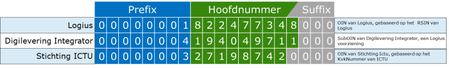

# Inleiding

Het OIN stelsel
---------------

In dit document beschrijven we het doel en de werking van het OIN Stelsel. Het OIN is gestart als een noodzakelijk onderdeel van de Digikoppeling Standaard en is inmiddels een veel gebruikt identificatienummer binnen en maar ook buíten Digikoppeling. De regels van uitgifte en gebruik van het OIN staan beschreven in de *Voorwaarden Digikoppeling* en de *Gebruiksvoorwaarden Digikoppeling*. Daarnaast geeft Logius OINs en SubOINs uit en slaat de informatie hiervan op in het OIN register en ontsluit die met de *[=COR=]*, de Centrale OIN Raadpleegvoorziening. Dit geheel van regels en uitvoering noemen we het *OIN stelsel*.

Waarom dit document
---------------------

De Voorwaarden Digikoppeling en de Digikoppeling Gebruiksvoorwaarden hebben een juridisch karakter en beantwoorden waarschijnlijk niet elke vraag van gebruikers van een OIN. In dit document proberen we daarom de werking van het OIN stelsel met al haar facetten nader te beschrijven in de hoop die vragen te beantwoorden.

Aanleiding voor een nieuwe versie van dit document
--------------------------------------------------

Dit document is een update op een versie die Logius in 2016 heeft uitgebracht. De aanleiding was toen een inventarisatie van een aantal inmiddels ontstane knelpunten met voorstellen voor de wijzigingen van de regels voor gebruik en uitgifte van OIN’s en SubOINs. Het document stond aan de basis voor de wijzigingen die in 2017 zijn doorgevoerd.

In 2020 heeft Logius de OIN regels opnieuw op punten aangepast. Dit gaf meteen de gelegenheid om het document bij te werken en in lijn te brengen met zowel de wijzigingen uit 2017 en de inmiddels vastgestelde wijzigingen van 2020.

Doel en scope van document
--------------------------

Dit document beschrijft het OIN-stelsel. Het OIN-stelsel bestaat uit de volgende bouwstenen:

- OIN- en SubOIN-systematiek

- Centrale OIN Raadpleegvoorziening (incl. OIN-register)

- Toelichting op de juridische voorwaarden en overeenkomsten

Historie van het OIN (en vooruitblik)
-------------------------------------

Bij de ontwikkeling van de Digikoppeling standaard in 2006 is besloten om de identificatie in de standaard te baseren op een uniek identificerend nummer van een overheidsorganisatie. [bron document "Evaluatie OIN uitgiftev2", 2010]

De behoefte aan een identificatienummer ontstond om een aantal redenen:

- Identificatie op basis van een nummer in plaats van een naam. Namen zijn moeilijk eenduidig te krijgen, door verschillende spellingen, afkortingen en hoofdletters;

- Stroomlijning en standaardisatie van identiteiten en autorisatie. Het was gewenst om *overheidsbreed* eensluidende afspraken te maken over niveaus van autorisatie en dus niveaus van identiteit;

[bron document "OIN alternatieven3", 2011]

### OIN en PKIoverheid

Het nummer wordt opgenomen in het PKIoverheidcertificaat - als inhoud van het attribuut Subject.serialNumber -  en wordt daarnaast gebruik in de adressering van berichten.

### *Overheids* Identificatienummer

Het unieke nummer werd het OIN, het *Overheidsorganisatie Identificatie Nummer*. De KvK - beheerder van het Handelsregister (HR) - adviseerde om het nummer op het FI-nummer te baseren. In het Handelsregister waren echter in die tijd niet alle overheidsorganisaties opgenomen die in het kader van de elektronische overheid van belang waren. Zo hadden allerlei zelfstandige onderdelen van een ministerie, zoals de Belastingdienst en Douane, geen eigen FI-nummer. 

Voor het gebruik van Digikoppeling was echter afgesproken dat organisaties én onderdelen van organisaties die berichten willen uitwisselen met een andere overheid, en daartoe zelfstandig contracten afsluiten, een identificerend nummer moeten krijgen, ook als dat onderdeel niet beschikt over een eigen FI-nummer. Besloten werd dat Logius het OIN ging uitdelen. Op termijn zou dan mogelijk altijd met een FI-nummer gewerkt kunnen worden, wanneer al die zelfstandige onderdelen ook in het Handelsregister zouden worden opgenomen. [bron document "Evaluatie OIN uitgiftev2", 2010]

### OIN en HRN

Ook voor private organisatie was een nummer noodzakelijk voor digitale gegevensuitwisseling met de overheid. Het OIN stond toen nog voor *Overheids*identificatienummer en liet niet toe dat ook deze partijen zich inschreven in het OIN register. Logius heeft daarom met de certificaatuitgevers aparte afspraken gemaakt om in het verplicht te gebruiken PKIoverheidcertificaat een nummer te laten opnemen volgens de structuur van het OIN. 

Voor een private organisatie werd niet het [=RSIN=] gebruikt, maar haar KvKnummer. Dit nummer kreeg de naam *Handelsregisternummer* (HRN). Het HRN is een virtueel nummer. Bij de aanvraag van een PKIoverheid-certificaat zal de Trust Service Provider ([=TSP=]), bij ontbreken van een OIN, het identificerend nummer bij de creatie van het certificaat zelf afleiden op basis van het KvK-nummer uit het Handelsregister op gelijke wijze als bij de afleiding van het OIN. Het [=HRN=]  wordt echter niet vastgelegd in een publiek raadpleegbare registratie.

### Nieuw Handelsregister

In 2010 werd door de KvK door een wetswijziging het nieuwe Handelsregister in gebruik genomen, waarin meer overheidsorganen, zoals de ministeries, ingeschreven konden worden. Het door Logius onderhouden OIN register bleef daarnaast bestaan. Het register bevatte inmiddels naast in het HR ingeschreven organisatie ook registraties van organisatie-onderdelen en voorzieningen en overheidsorganisaties die zich niet kunnen inschrijven in het HR. In 2014 is een publieke website gelanceerd waarin iedereen het OIN van een organisatie kon opzoeken.

### OIN 2016: *Organisatie* Identificatienummer

In 2016 zijn na brede afstemming met gebruikers de regels verduidelijkt van wie in aanmerking kwam voor een OIN en SubOINs.  De onderbouwing van de regels werden vastgelegd in het document [OIN stelsel v1](#inleiding). De spelregels van het OIN zijn vastgelegd in de [[Voorwaarden Digikoppeling]] en de [[Gebruiksvoorwaarden Digikoppeling]].

<aside class="note">
Sinds de wijziging van 2016 staat de afkorting voor OIN voor <strong>Organisatie</strong> Identificatienummer.
</aside>

### Doorontwikkeling [=COR=]

Logius heeft sinds 2017 een aantal wijzigingen doorgevoerd in de ontsluiting van het OIN register:

- in 2017 werd de OIN website hernoemd in en uitgebreid naar de **Centrale OIN Raadpleegvoorziening ([=COR=])**. De [=COR=] toont op de website naast de OINs ook de (Hoofd)OIN-houder indien die aanwezig is.

- De aanduiding of de vermelde OIN voor eFacturatie gebruikt kon worden is verwijderd, op verzoek van Logius;

- in 2018 is op verzoek van een aantal organisaties een RESTful API toegevoegd waarmee het OIN register online bevraagd kan worden. De website bleef ongewijzigd;

- in 2019 is aan het OIN register een aantal identificerende nummers toegevoegd, de BG codes voor gemeente en de CBS codes voor Waterschappen en Provincies. Deze gegevens zijn enkel via de [=COR=] API opvraagbaar.

### Nieuwe voorstellen in 2020

- in 2020 dient Logius een voorstel in dat mogelijk maakt dat *privaatrechtelijke partijen met een publieke taak* en *privaatrechtelijke partijen ten behoeve van (SAAS-)dienstverlening* aan hun publieke klanten SubOINs’s kunnen aanvragen.

- in 2020 wordt voor het UZI register prefix '00000009' gereserveerd

### nieuwe vastgestelde versie in 2021

De nieuwe voorstellen zijn na openbare consultatie vastgesteld door het Technisch Overleg Digikoppeling.  Op 1 januari 2021 zijn de [[Voorwaarden Digikoppeling]] en de [[Gebruiksvoorwaarden Digikoppeling]] gepubliceerd.

## Leeswijzer

De structuur van dit document is gebaseerd op de TOGAF standaard - TOGAF staat voor The Open Group Architecture Framework- .


|Hoofdstuk|Inhoud|
|---|---|
|Architectuurvisie| beschrijft op hoofdlijnen het doel en de kaders van het OIN|
|Businessarchitectuur| beschrijft de wijzingen en de rollen in het OIN|
|ApplicatieArchitectuur| beschrijft de functies van de [=COR=]|
|Het beheer van SubOINs in de [=COR=]| een apart hoofdstuk over uitgifte en beheer van SubOINs|
|Data Architectuur|beschrijft de structuur van het OIN en SubOIN|
|Technologie-Architectuur| geeft een technische beschrijving van de [=COR=] en de hieraan gekoppelde systemen en bronnen|
|Bijlage A|Begrippenlijst|
|Bijlage B|Nuttige links|

# Architectuurvisie

Doel OIN
--------

Het organisatie-identificatienummer ([=OIN=]) is het identificatienummer voor niet-natuurlijke personen ten behoeve van het digitale berichtenverkeer met de overheid. De toekenning van het [=OIN=] is gebaseerd op identificatie van de aanvrager van het [=OIN=] middels het Handelsregister dan wel een ander aangesloten overheidsregister.

## Inleiding

Het Organisatie-identificatienummer [=OIN=], voorheen Overheidsidentificatienummer, is onderdeel van de Digikoppeling standaard. De standaard wordt gebruikt in elektronische gegevensuitwisseling met en door de overheid. Het [=OIN=] is een twintigcijferig nummer dat een organisatie identificeert in het digitale berichtenverkeer. Digikoppeling verplicht de opname van het [=OIN=] in het PKIoverheid certificaat zodat systemen kunnen worden geïdentificeerd en geauthenticeerd. Daarmee is het [=OIN=] een randvoorwaarde voor veilig digitaal verkeer.

Een groot aantal voorzieningen van de digitale overheid maakt gebruik van het [=OIN=]. Dat gebeurt op verschillende manieren en met verschillende doeleinden: de identificatie, authenticatie en autorisatie van organisaties of organisatieonderdelen, en de routering van berichten naar organisaties,organisatieonderdelen of voorzieningen.

Gebruik van het OIN
-------------------

Het [=OIN=]-nummer wordt als identificerend nummer gebruikt in PKIoverheidcertificaten (authenticatie), in de adressering en routering van berichten, en in autorisatietabellen. Organisaties mogen het [=OIN=] of [=SubOIN=] gebruiken voor identificatie van organisaties en organisatieonderdelen in het digitaal verkeer. Het overig gebruik van het [=OIN=] of [=SubOINs=] betreft:

- Authenticatie

- Autorisatie

- Adressering

- Routering


| **Functie**| **Definitie**| **Toelichting functie OIN** |
|---|---|---|
| [Identificatie (Identificeren)](http://www.noraonline.nl/wiki/Identificatie) | Het bekend maken van de identiteit van personen, organisaties of IT-voorzieningen. (Bron: *NORA 3.0 Principes voor samenwerking en dienstverlening)* | Het [=OIN=] of [=SubOIN=] is het identificerende nummer voor organisaties t.b.v. digitaal verkeer met de overheid.|
| [Authenticatie (Authenticeren)](http://www.noraonline.nl/wiki/Authenticatie) | Het aantonen dat degene die zich identificeert ook daadwerkelijk degene is die zich als zodanig voorgeeft: ben je het ook echt? Authenticatie noemt men ook wel verificatie van de identiteit. (Bron: *NORA 3.0 Principes voor samenwerking en dienstverlening)* | Het [=OIN=] of [=SubOIN=] wordt opgenomen in het subject serialNumber veld van het PKIoverheid certificaat. |
| [Autorisatie (Autoriseren)](http://www.noraonline.nl/wiki/Authenticatie) | Het proces van het toekennen van rechten voor de toegang tot geautomatiseerde functies en/of gegevens in ICT voorzieningen.| Het feit dat een organisatie over een [=OIN=] of SubOINs beschikt zegt niets over enige autorisatie op gegevens of informatie. Dit is voorbehouden aan de verstrekkende partij die dit zelf beoordeelt. Partijen die voorzieningen aanbieden kunnen zelf autorisatielijsten bijhouden waarin het [=OIN=] van geautoriseerde organisaties kan worden opgenomen. |
| **Adresseren** | Het aangeven van de ontvangende partij (en de verzendende partij) in het bericht.| Digikoppeling schrijft b.v. voor dat het [=OIN=] of [=SubOIN=] wordt gebruikt in de header voor adressering.|
| **Routeren** | Het doorsturen van een bericht aan de geadresseerde partij bijvoorbeeld via een routeringsregel of tabel.| Routering vertaalt het logische adres – het [=OIN=] of [=SubOIN=] – naar een fysiek endpoint (url). |


Context Centrale OIN Raadpleegvoorziening ([=COR=])
-----------------------------------------------

In onderstaand diagram wordt de relatie tussen [=COR=] met de omgeving weergegeven.


Kaders en bronnen
-----------------

De volgende kaders en bronnen zijn gehanteerd bij de uitwerking van het OIN-stelselv1 en v2:

- NORA is het kader voor de uitwerking van de Centrale OIN Raadpleegvoorziening.

- Memo OIN: *Gebruik van OIN, knelpunten en oplossingen Het memo met opleggers zijn op aangeboden aan de Regieraad Gegevens van 14 januari 2016. De stukken zijn schriftelijk besproken. De stukken zijn te vinden op* [https://digitaleoverheid.pleio.nl/file/group/30207952/all#41536872](https://digitaleoverheid.pleio.nl/file/group/30207952/all#41536872)]

- [[Voorwaarden Digikoppeling]]: De Voorwaarden Digikoppeling bevatten de specifieke voorwaarden die gelden tussen Logius en [=Afnemers=] in het kader van Digikoppeling in aanvulling op de [[Algemene Voorwaarden Logius]], van toepassing op alle diensten van Logius.  

- [[Gebruiksvoorwaarden Digikoppeling]]: De Gebruiksvoorwaarden Digikoppeling bevatten de specifieke voorwaarden die gelden tussen Logius en [=Gebruikers=] in het kader van Digikoppeling in aanvulling op de [[Algemene Voorwaarden Logius]], van toepassing op alle diensten van Logius. 

# Businessarchitectuur

Wat is het OIN
---------------

Het Organisatie-identificatienummer ([=OIN=]) is een uniek nummer dat Logius kan toekennen aan organisaties om zich te kunnen identificeren, authentiseren en of autoriseren bij digitaal berichtenverkeer binnen en met de overheid.

Voor wie is het OIN
--------------------

Het [=OIN=] is voor organisaties die berichten uitwisselen met de overheid. Dit kunnen publieke en private organisaties zijn. Voorwaarde is dat zij staan ingeschreven in het handelsregister. Daarnaast kunnen ook een aantal organisaties die niet in het handelsregister zijn opgenomen een [=OIN=] aanvragen. Dit zijn bijzondere organisaties met een publieke taak, colleges van advies en internationale organisaties met een rechtspersoonlijkheid.

Het [=OIN=] maakt een onderscheid in [=gebruikers=] en [=afnemers=]. Beiden kunnen het [=OIN=] aanvragen. Deze begrippen komen uit de [[Algemene Voorwaarden Logius]] voor [=afnemers=] en zijn als volgt gedefinieerd:

- <dfn data-lt="Afnemers">Afnemer</dfn>: een publiekrechtelijke of privaatrechtelijke organisatie, of college of een persoon met een publieke taak of bevoegdheid, die voor de uitoefening van die publieke taak elektronisch verkeer met andere overheden en burgers en/of bedrijven wenselijk acht en daarbij gebruik kan en mag maken van één of meer Diensten van Logius.

- <dfn data-lt="Gebruikers">Gebruiker</dfn>: een overheidsorganisatie of onderneming of een rechtspersoon, die is ingeschreven in het Handelsregister of een natuurlijk persoon die is ingeschreven in de Gemeentelijke Basisadministratie persoonsgegevens (GBA), en in deze hoedanigheid gebruik maakt van de Diensten van Logius ten behoeve van het elektronisch verkeer met één of meerdere [=Afnemers=].

Op welke manier kan een organisatie een OIN verkrijgen
-------------------------------------------------------

Bedrijven en privaatrechtelijke instellingen die digitaal communiceren met de overheid hebben daarvoor in veel gevallen een identificerend nummer nodig. Dit identificerende nummer kan op twee manieren verkregen worden:

1. Bij Logius: Door een [=OIN=] (Organisatie Identificatie Nummer) aan te vragen bij Logius via een aanvraagformulier op Logius.nl. Het [=OIN=] wordt afgeleid van het KvK-nummer uit het Handelsregister. Het [=OIN=] wordt vastgelegd in een register dat publiek raadpleegbaar is via de centrale [=OIN=] Raadpleegvoorziening ([https://portaal.digikoppeling.nl/registers/](https://portaal.digikoppeling.nl/registers/)) via een website en een API. De regels uit de [[Voorwaarden Digikoppeling]] en de [[Gebruiksvoorwaarden Digikoppeling]] zijn van toepassing. Er zijn geen kosten verbonden aan deze registratie.

2. Bij de [=TSP=]: Bij de aanvraag van een PKIoverheid-certificaat zal de Trust Service Provider ([=TSP=]), bij ontbreken van een [=OIN=], het identificerend nummer bij de creatie van het certificaat zelf afleiden op basis van het KvK-nummer uit het Handelsregister op gelijke wijze als bij de afleiding van het [=OIN=]. Dit nummer wordt een [=HRN=] genoemd.  Er vindt echter geen publiek raadpleegbare registratie plaats. Voor de werking van het dataverkeer met de overheid is er verder geen verschil.

Wat is een SubOIN
------------------

Het [=SubOIN=] is een afgeleide van het [=OIN=] en is opgesteld volgens de OIN-nummersystematiek en wordt gebruikt voor een organisatieonderdeel, samenwerkingsverband of voorziening dat niet zélf in het Handelsregister voorkomt. Een [=SubOiN] valt altijd onder een [=OIN-houder=]. 

Ook kan Logius op verzoek van een verantwoordelijke [=SubOIN-beheerder=] een SubOIN toekennen aan een organisatie, instelling of buitenlandse rechtspersoon in zijn sectorregistratie. Het SubOIN fungeert, net als een OIN, als numeriek alternatief voor de naam daarvan, ten behoeve van de identificatie, authenticatie, autorisatie, adressering en routering van digitaal berichtenverkeer met en binnen de overheid.

Voor wie is het SubOIN
-----------------------

Het [=SubOIN=] is aan te vragen door organisaties die voor het uitvoeren van een publieke taak behoefte hebben aan een identificerend nummer voor een samenwerking (waar het zelf deel van uit maakt), organisatieonderdeel of voorziening.

Daarnaast kan Logius [=SubOIN-beheerders=] aanwijzen die een [=SubOIN=] aanvragen voor partijen die als onderdeel van hun dienstverlening aan de overheid een uniek identificerend nummer nodig hebben en het OIN nummer hiervoor niet kunnen aanvragen.

Wijzigingen in het OIN Stelsel sinds 2006
------------------------------------------

Sinds het onstaan van het OIN is een aantal wijzigingen doorgevoerd in de toekenning en het gebruik van het OIN. De belangrijkste wijzingen geven we hieronder weer:

In 2017 zijn - naast duidelijker uitgeschreven juridische kaders- de volgende aanpassingen in de OIN regels uitgevoerd:

- de mogelijkheid voor organisaties met publieke rechtspersoonlijkheid om SubOINs aan te vragen voor aan hen gerelateerde organisatieonderdelen, voorzieningen en samenwerkingsverbanden

- de mogelijkheid voor houders van sectorregistraties om op te gaan treden als [=SubOIN-beheerder=] en op die manier door hen geregistreerde organisaties die geen eigen (Nederlandse) rechtspersoonlijkheid bezitten ook van SubOINs’s te voorzien.

- private partijen, die staan geregistreerd bij de KvK, krijgen de mogelijkheid om zich ook te laten registreren in de [=COR=] waarbij er een OIN afgeleid wordt van het KvK-nummer toegekend en de organisatiegegevens vanuit het Handelsregister worden overgenomen.

- Met het doorvoeren van het nieuwe beleid is het begrip OIN van *Overheids* IdentificatieNummer gewijzigd naar *Organisatie* IdentificatieNummer.

In 2017 verving de [=COR=] het toenmalige OIN register. Aan de [=COR=] werden de volgende nieuwe functionaliteiten toegevoegd:

- De relatie tussen SubOINs en de verantwoordelijke rechtspersoon kan in de [=COR=] worden vastgelegd en wordt publiekelijk getoond bij raadpleging van de voorziening (alleen in de [=COR=] API)

- De mogelijkheid tot aan laten maken, wijziging en intrekking van OIN’s door beheerders van de [=COR=] is toegevoegd.

- Beheerders van de [=COR=] hebben de mogelijk gekregen om de organisatiegegevens behorend bij een OIN rechtstreeks vanuit het Handelsregister via de KVK-API op te vragen en in de [=COR=] over te nemen waarmee de kwaliteit van geregistreerde gegevens kan worden verhoogd zonder extra handmatige handelingen.

- De exportfunctionaliteit waarmee de inhoud van de [=COR=]-database in CSV-formaat kan worden gedownload is publiek beschikbaar gemaakt.

- Beheerders van de [=COR=] hebben de mogelijkheid gekregen om de relatie met een OIN van de ene rechtspersoon naar een andere rechtspersoon over te dragen. Dit komt van pas als er een organisatieonderdeel of voorziening overgaat van de ene instantie naar een andere.

- Het al dan niet kunnen gebruiken van OINs of SubOINs voor e-facturatie wordt publiekelijk getoond.

- Niet alleen actieve Oins en SubOINs maar ook ingetrokken OINs en SubOINs worden publiekelijk getoond.

- Er is een voorziening aangebracht waarmee het aantal bevragingen van de [=COR=] kan worden gerapporteerd.

De [=COR=] wordt sinds de lancering steeds verder doorontwikkeld en aangepast;

- het eFacturatie kenmerk wordt niet meer getoond in de [=COR=]. Deze informatie over is nu te vinden op [https://www.logius.nl/diensten/e-factureren](https://www.logius.nl/diensten/e-factureren)

- Restful API op de [=COR=]: de [=COR=] API biedt verschillende mogelijkheden om het OIN register te bevragen

- extra identificerende codes toegevoegd aan het OIN register. Hierdoor is het mogelijk om via de [=COR=] API de vertaling te maken van OIN naar Gemeentecode en omgekeerd. Naast Gemeentecode kan een vertaling worden opgevraagd naar Provincie-, Waterschap- of Ministeriecode

Het gebruik van het OIN neemt steeds meer toe. Hierdoor zijn nieuwe knelpunten in de praktijk onstaan waarbij de OIN spelregels niet overeenkwamen met de behoefte en noden van organisaties.

In 2020 legt Logius een aantal wijzigingsvoorstellen in de OIN spelregels aan de Digikoppeling Community. De nieuwe spelregels zijn verwerkt in de aangepaste *Voorwaarden Digikoppeling* en *Gebruiksvoorwaarden Digikoppeling*.

Belangrijkste wijzigingen in het voorstel van 2020:

- Private partijen met een publieke taak kunnen SubOINs aanvragen;

- Private partijen kunnen ten behoeve van (SAAS-)dienstverlening voor hun publieke klanten SubOINs aanvragen

Daarnaast zijn de beide Voorwaarden documenten verduidelijkt en up-to-date gebracht. Voor het OIN gaat het om de volgende onderdelen:

- Geen vermelding meer tbv e-factureren in de [=COR=]

- Vermelding van het gebruik van organisatiecodes in de [=COR=]

Rollen in het OIN stelsel
-------------------------

### Afnemer
Logius definieert dit bergip in de [[Algemene Voorwaarden Logius]] als volgt:
> Een publiekrechtelijke of privaatrechtelijke organisatie, of college of een persoon met een publieke taak of bevoegdheid, die voor de uitoefening van die publieke taak elektronisch verkeer met andere overheden en burgers en/of bedrijven wenselijk acht en daarbij gebruik kan en mag maken van één of meer Diensten van Logius.

Een [=afnemer=] van een OIN  kan zowel een aanbieder van diensten zijn als een organisatie die gebruikmaakt van diensten van andere organisaties.On der het begrip [=afnemer=] van een OIN vallen ook organisaties die beschreven zijn in de Algemene wet Bestuursrecht, zoals de Tweede en Eerste Kamer.

### Stakeholders

Stakeholders bij het gebruik van het OIN-Stelsel zijn in beginsel alle partijen die gebruik maken van het [=OIN=] en [=SubOIN=] en/of bijbehorende Centrale OIN raadpleegvoorziening ([=COR=]) én de partijen die een rol hebben bij het beheer van het OIN.

### Opdrachtgever

Het ministerie van BZK (BZK) is opdrachtgever van Logius en eigenaar van het OIN-stelsel. Als eigenaar draagt BZK ook verantwoordelijkheid voor toezicht en audits over de centrale voorziening en afspraken.

### Beheerder OIN-stelsel

Logius beheert het OIN Stelsel. Het OIN valt onder de Digikoppeling Standaard. Het Centrum voor Standaarden, van Logius is beheerder van de Digikoppeling standaard en voert ook het beheer over van het OIN-stelsel, voorwaarden en overeenkomsten.

### Beheerder COR

Logius beheert de Centrale OIN Raadpleegvoorziening ([=COR=]). Logius Team Interfaces, onderdeel van het Productiehuis van Logius voert het dagelijks beheer en de doorontwikkeling uit van de [=COR=]. Logius heeft de zorgplicht om de [=COR=] online toegankelijk te houden voor de gebruikers van de [=COR=].

### Registerhouder overheidsregister

De registerhouder beheert een overheidsregister en waarborgt de kwaliteit van de te raadplegen nummers en bijbehorende gegevens. Voor elke entiteit die is opgenomen in het overheidsregister is duidelijk wie de verantwoordelijke rechtspersoon is. De verantwoordelijke rechtspersoon is herkenbaar aan de hand van het identificerende nummer ([=RSIN=], [=KvKnummer=] of [=OIN=]). Het register heeft geborgd dat als de rechtspersoon ophoudt te bestaan, de registratie van de entiteit vervalt.

### SubOIN-beheerder

Een overheidsorganisatie die door Logius de status is verleend van SubOIN-beheerder en die op basis van geldige registraties met unieke identificerende nummers in de sectorregistratie die deze voor de uitvoering van zijn publiekrechtelijke taak beheert, voor eigen rekening en risico, [=SubOIN=]’s kan laten aanmaken, toekennen, beheren, corrigeren of intrekken.

De [=SubOIN-beheerder=] draagt zorg voor de registratie van SubOINs voor organisaties die niet in een aangesloten register voorkomen maar die wel bij een broninstantie of op basis van brondocumenten kunnen worden geïdentificeerd en geverifieerd. De [=SubOIN-beheerder=] is verantwoordelijk voor het doorgeven van mutaties.

### Certificatiedienstverlener (TSP)

Een [=TSP=] geeft certificaten uit conform de eisen uit het PvE van PKIoverheid. Daarmee zijn zij verantwoordelijk voor de betrouwbaarheid van de genoemde certificaten. De [=TSP=]'s doen met het oog op het uitgeven van een certificaat onderzoek naar de identiteit van de organisatie en de tekenbevoegdheid van de aanvragers van een certificaat. De voorwaarden hiervoor zijn beschreven in het PvE PKIo PvE. Tevens controleren zij de identiteit van de aanvrager op grond van een face to face controle. De [=TSP=] raadpleegt het OIN van de aanvrager via de [=COR=] en neemt dit nummer en naam op in het PKIoverheid certificaat.

### OIN-houder

De [=OIN-houder=] is een rechtspersoon met een publieke taak, die gebruik maakt van het OIN. Slechts een [=OIN-houder=] kan een [=SubOIN=] aanvragen voor een organisatie, organisatie-onderdeel of voorziening. De OIN houder is er verantwoordelijk voor dat de gegevens die gekoppeld aan zijn [=OIN=] en [=SubOIN=](s) juist zijn, en blijven.

In dit document gebruiken we de term [=OIN-houder=] voor een organisatie die is ingeschreven in het handelregister en OINs of SubOINs aanvraagt en beheert. De [[Voorwaarden Digikoppeling]] en [[Gebruiksvoorwaarden Digikoppeling]] heeft het niet over OIN-houders maar gebruiken de begrippen *[=afnemer=]* en [=gebruiker=].

### Beheerder PvE PKIoverheid

Logius PKIoverheid is beheerder van het Programma van Eisen van PKIoverheid en *Policy Authority* (toezichthouder) op de [=TSP=]'s.

Juridische structuur
--------------------

Aansluitend op de beschrijving en uitleg van de rollen van betrokken partijen in het vorige hoofdstuk worden de kernbegrippen in de juridische context toegelicht.

Er van uitgaande dat het OIN voorlopig geen wettelijke grondslag krijgt zijn de [[Voorwaarden Digikoppeling]] en de OIN-formulieren de aangewezen plaats om de spelregels voor de betrokken partijen te definiëren.

### OIN-voorwaarden en OIN–formulieren

Onderstaand schema beschrijft op welke manier organisaties een OIN of SubOINs bij Logius kunnen aanvragen

")
### Identificatie

Het gebruik van een Organisatie Identificatienummer (OIN) beoogt rechtspersonen en niet-rechtspersonen te identificeren ten behoeve van digitale berichtenverkeer met de overheid.

### Handelsregister

Een OIN is -waar mogelijk- afgeleid van bestaande identificerende nummers uit het Handelsregister.

### Rechtspersonen en samenwerkingsverbanden

Rechtspersonen en samenwerkingsverbanden *Dit zijn de samenwerkingsverbanden die zich conform de Hrw in kunnen schrijven in het Handelsregister.* worden ex art.6 Handelsregisterwet (Hrw) ingeschreven in het Handelsregister, en kunnen dus worden geïdentificeerd ten behoeve van het gebruik van het OIN. Tevens kunnen de in art. 1:2 Algemene wet bestuursrecht (Awb) omschreven overheidsorganen, die niet in het Handelsregister kunnen worden ingeschreven, een OIN verkrijgen.

### Buitenlandse rechtspersonen en organisaties

Buitenlandse rechtspersonen en organisaties die niet ingeschreven kunnen worden in een Nederlands overheidsregister, maar wel voldoen aan de vereisten voor een PKIoverheidscertificaat, kunnen bij een [=SubOIN-beheerder=] een aanvraag indienen voor een OIN. Na controle door een [=SubOIN-beheerder=] kunnen deze buitenlandse organisaties een OIN krijgen.

### OIN

Organisaties, organisatieonderdelen en/of voorzieningen die niet in een aangesloten overheidsregister voorkomen, komen mogelijk toch in aanmerking voor een OIN. (In enkel bijzondere gevallen ook voor een OIN. Het gaat dan om het OIN dat wordt toegekend aan een onderdeel van de Staat der Nederlanden). Deze worden geregistreerd in het OIN-register. Een [=SubOIN=] is een identificerend nummer voor niet-rechtspersonen. Het [=SubOIN=] heeft dezelfde structuur als het OIN. Een [=SubOIN=] is altijd herleidbaar tot een rechtspersoon die is ingeschreven in het Handelsregister en valt onder de juridische verantwoordelijkheid van deze rechtspersoon.

### OIN-houder

De [=OIN-houder=] is een rechtspersoon met een publieke taak die gebruik maakt van het OIN. Slechts de [=OIN-houder=] kan een OIN aanvragen voor een organisatie, een organisatieonderdeel of een voorziening die onder zijn juridische verantwoordelijkheid valt. De [[Voorwaarden Digikoppeling]] en [[Gebruiksvoorwaarden Digikoppeling]] heeft het niet over OIN-houders maar gebruiken de begrippen [=afnemer=] en gebruiker. De [=OIN-houder=] zal zich ervan moeten vergewissen dat hij middels juridische afspraken – zoals bijvoorbeeld statuten, een overeenkomst, een inschrijving in een register en/of een mandaatbesluit – juridische verantwoordelijkheid kan dragen voor het handelen van de organisatie of organisatieonderdeel, die gaat beschikken over een OIN. Een eis is dat de functionaris, die de aanvraag voor een OIN doet, tekenbevoegd is.

De [=OIN-houder=] heeft een zorgplicht met betrekking tot het handelen door de houder van het [=OIN=], voor zover dit handelen betrekking heeft op de elektronische berichtenuitwisseling waarbij gebruik wordt gemaakt van het [=OIN=] en bijbehorende [=SubOIN=]s.

### SubOINs op basis van een aangesloten register

Als een organisatie geregistreerd is in een aangesloten register (niet het Handelsregister), dan kan het identificerend nummer uit dit register worden gebruikt als [=SubOIN=]s. Daarmee is een aangesloten register in feite een register van SubOINs voor een specifieke doelgroep.

### Opnemen OIN in PKIoverheidscertificaat

De [=TSP=] neemt een [=OIN=] of [=SubOIN=] op in een PKIoverheidscertificaat. Hiervoor wordt het *Subject.serialNumber* veld van het certificaat gebruikt.

Centrale OIN Raadpleegvoorziening (COR)
----------------------------------------

Logius is beheerder van de Centrale OIN Raadpleegvoorziening (inclusief het OIN-register) in opdracht van BZK. De [=COR=] heeft niet het karakter van een basisregistratie of een sectorale registratie. De [=COR=] is een landelijke voorziening.

Toezicht uitoefenen
-------------------

Logius moet toezien op de naleving van de voorwaarden en de afspraken die partijen met Logius maken.Logius moet voldoen aan de kwaliteitseisen vanuit haar opdrachtgever BZK. Daarbij is de mogelijkheid aanwezig dat BZK onafhankelijke derden, zoals de ADR *Auditdienst Rijk*, inschakelt om controles uit te voeren. Daarmee is de functiescheiding gewaarborgd.

### Naleving Voorwaarden OIN

De beheerder van het OIN-stelsel controleert op basis van signalen en steekproefsgewijs de naleving van de OIN-voorwaarden en de ondertekende aanvraagformulieren met de OIN–houders, die [=SubOIN=]s uitgeven.

### Naleving overeenkomsten

De beheerder van het OIN-stelsel controleert de naleving van de overeenkomsten, af te sluiten met de SubOIN-beheerders en met de registratiehouders.

### Toezicht BZK

De opdrachtgever BZK beoordeelt binnen het regulier toezicht op de beheerder van het OIN-stelsel in hoeverre de OIN-voorwaarden en overeenkomsten nageleefd worden door de betrokken contractspartijen.

Internationale uitwisselingen
-----------------------------
## OIN ICD Code 

Volgens de ISO 6523 part 1 standaard is een ICD code (International Code Designator) nodig. Het OIN is sinds 2018 opgenomen in de ICD lijst 

De volgende alinea's geven achtergrondinformatie over de ISO 6523 standaard.

### Mapping naar de ISO 6523 standaard

Het OIN is aangemeld en opgenomen in in ICD Codelist: (zie [https://docs.peppol.eu/pracc/catalogue/1.0/codelist/ICD/](https://docs.peppol.eu/pracc/catalogue/1.0/codelist/ICD/)). Het OIN is geregistreerd onder *code id 0190* met de volgende beschrijving

>Organisatie Indentificatie Nummer (OIN)
>
> The OIN is part of the Dutch standard ‘Digikoppeling’ and is used for identifying the organisations that take part in electronic message exchange with the Dutch Government. The OIN must also be included in the PKIo certificate.

# Applicatie-architectuur

Gebruik van de Centrale OIN Raadpleegvoorziening
------------------------------------------------

Het OIN van een rechtspersoon is publiek raadpleegbaar via de Centrale OIN Raadpleegvoorziening ([=COR=]). De [=COR=] registreert organisaties en stelt het OIN samen op basis van de OIN-systematiek (zie bijlage A). Voor de registratie baseert de [=COR=] gebruikt zich waar mogelijk op registers met een wettelijke of formele taak, zoals het Handelsregister en het FI register. De gebruiker kan in de [=COR=] zoeken op nummer of naam. De zoekresultaten worden aan de gebruiker getoond.

De [=COR=] is sinds 2017 als publiek toegankelijke voorziening beschikbaar.

De [=COR=] bestaat uit de volgende kern-onderdelen:

- Een publiek toegankelijk raadpleegvoorziening.

- Een webservice die een Restful API aanbiedt

- Een beheermodule waarmee Logius beheerders de registraties in de [=COR=] bijhouden.

Publieke raadpleegvoorziening
-----------------------------

De [=COR=] biedt de volgende services voor gebruikers:

- Online zoeken naar OINs en [=SubOIN=]s op basis van nummers, organisatienamen of delen ervan

- Restful API functionaliteit

- Export van alle geregistreerde organisaties in CSV formaat

Beheerfuncties
--------------

De [=COR=] biedt, naast bovenstaande, de volgende services voor beheerders:

- Detailinformatie over de geregistreerde organisaties en een bewerkmogelijkheid om deze informatie aan te passen

- Historie/audittrail van alle doorgevoerde wijzigingen per registratie

- Mogelijkheid om nieuwe OIN- en [=SubOIN=]-registraties toe te voegen

- Mogelijkheid om actieve OINs en [=SubOIN=]s in te trekken

- Data synchronisatie tussen de [=COR=] database en het Handelsregister, zowel bij invoer van nieuwe registraties als periodiek, om bestaande registraties te verifiëren

- Lifecycle management van OIN

- Gebruikersbeheer

Algemene eisen aan de Centrale OIN Raadpleegvoorziening
-------------------------------------------------------

De Centrale OIN Raadpleegvoorziening voldoet aan de volgende eisen:

- De authenticatie van beheerders verloopt via een beveiligd authenticatiemiddel.

- Er is een systeemcontrole die voorkomt dat er duplicaten van OIN's of [=SubOIN=]s ontstaan.

- Er is een systematiek(algoritme) voor het genereren van een uniek nummer die gaat dienen als [=SubOIN=]s.

- De beheerder treft passende beveiligingsmaatregelen om de privacy van de verwerking van persoonsgegevens te waarborgen, zoals de Logiusbeveiligingsrichtlijnen (ISO27000-1 en ISO 27000-2) en IB policies.

- Maakt gebruik van Nederlandse API Design Rules voor webservice.

- Voorziet in een audittrail van mutaties op een registratie.

- Voorziet in management rapportages die inzicht bieden in aantallen OIN, gebruikers, activiteiten OIN-houders enzovoort.

- Voldoet aan Digitoegankelijk

- Volgt de principes en kaders van NORA.

Centrale OIN Raadpleegvoorziening ([=COR=])
---------------------------------------

### Onderdelen van de [=COR=]

De [=COR=] bestaat uit een publiek toegankelijk gedeelte en een besloten gedeelte. Het publiek toegankelijke deel wordt ontsloten door een website en een webservice met een Restful API.

### Toegang tot het besloten gedeelte van de [=COR=]

Enkel daarvoor aangewezen medewerkers van Logius hebben toegang tot het besloten gedeelte van de [=COR=].

### Registratie in het besloten gedeelte van de [=COR=]

De beheerder van de [=COR=] registreert in het besloten gedeelte van de [=COR=]:

- Het uitgeven van een nieuw [=OIN=] en [=SubOIN=].

- Het intrekken van een bestaand [=OIN=] of [=SubOIN=].

- Het verlengen van de geldigheidsdatum van een [=OIN=] of [=SubOIN=]

- Het verlengen van een [=OIN=] of [=SubOIN=] die was ingetrokken na de standaard geldigheidsduur

- Wijzigingen in de registratie van organisatie(onderdelen) of voorzieningen.


### Publiceren van OIN en SubOINs

het [=OIN=] of [=SubOIN=] is pas openbaar toegankelijk, nadat de beheerder van de [=COR=] het [=OIN=] heeft gepubliceerd. Het [=OIN=] of [=SubOIN=] bezit dan de status *Actief*. De [=COR=] toont ook [=OIN=] en [=SubOIN=]s die ingetrokken zijn.

### Aansluiten [=COR=] op overheidsregisters

De beheerder van het OIN-stelsel bepaalt welke overheidsregisters onderdeel uitmaken van de OIN-systematiek. De beheerder van het OIN-stelsel maakt afspraken over het gebruik van deze registers met de registratiehouders. De registratiehouders zijn verantwoordelijk voor de kwaliteit van gegevens en voor de beschikbaarheid van het register.

### Gebruik van de [=COR=] API

De [=COR=] API is publiek beschikbaar voor systemen. De beheerder van de [=COR=] kan de toegang reguleren, bijvoorbeeld door het verstrekken van zogenaamde API-keys, of door gebruik te maken van tweezijdig TLS.

### Privacybescherming en informatiebeveiliging

De beheerder van de [=COR=] is verantwoordelijk voor de privacybescherming van persoonsgegevens in de [=COR=] en de informatiebeveiliging met betrekking tot de [=COR=], en komt derhalve de van toepassingzijnde wet – en regelgeving na.

### Kwaliteitsborging

De beheerder van de [=COR=] is verantwoordelijk voor de goede werking van de [=COR=], het bieden van ondersteuning bij het gebruik van de CORen  de beschikbaarheid van het systeem. De beheerder van de [=COR=] is verantwoordelijk voor het correct vastleggen van (Sub)OINs en bijbehorende gegevens in de [=COR=], zoals die worden aangeleverd door de aanvrager.

De beheerder van de [=COR=] is niet verantwoordelijk voor de kwaliteit van de geregisteerde [=OIN=] gegevens. De rechtspersonen aan wie [=SubOIN=]s zijn uitgegeven hebben een zorgplicht met betrekking tot de inhoud van de geregistreerde gegevens in de [=COR=]. Bij twijfel over de juistheid van geregistreerde gegevens kan de beheerder van de [=COR=] maatregelen nemen om de kwaliteit van subnummer registraties te toetsen en desgewenst te herstellen. De beheerder van de [=COR=] is niet verantwoordelijk voor de kwaliteit van de gegevens uit de aangesloten overheidsregisters.


# Het beheer van SubOINs in de [=COR=]

SubOINs: uitgifte
------------------

### Regels voor uitgifte SubOINs

**Aanmaken SubOINs**

Een rechtspersoon, die [=OIN-houder=] is, kan een [=OIN=] aanvragen voor een entiteit zonder rechtspersoonlijkheid - te weten een organisatie, organisatieonderdeel of voorziening - waarvoor hij de juridische verantwoordelijkheid neemt voor het gebruik van [=SubOIN=]s. De [=SubOIN=]s worden beheerd in het *SubOIN-register*, onderdeel van de [=COR=]. Onder de definitie van een entiteit vallen ook diensten zoals (landelijke) voorzieningen, mits deze als een onderdeel van een organisatie beschouwd kunnen worden en geïdentificeerd moeten worden voor informatie-uitwisseling. Logius maakt op verzoek van een [=SubOIN-beheerders=] [=SubOIN=]s aan in de [=COR=].

**Organisaties in andere registers dan het Handelsregister**

Organisaties die geregistreerd staan in andere aangesloten registers dan het Handelsregister worden beschouwd als houders van een [=OIN=]. Voor deze organisaties gelden dezelfde regels als houders van [=SubOIN=]s die door rechtspersonen zijn aangemaakt.

### Aanvragen PKIoverheidscertificaat

De [=OIN-houder=] vraagt een PKIoverheidscertificaat aan ten behoeve van identificatie/authenticatie, signing of encryptie. De [=TSP=] verstrekt het PKIoverheidcertificaat aan de houder van het [=OIN=]. Als een PKI Overheid certificaat wordt aangevraagd door de [=OIN-houder=] ten behoeve van een [=OIN-houder=], dan neemt de [=TSP=] daarin het [=OIN=] op en de bijbehorende naam uit het OIN-register.

### Samenwerkingsverbanden

Een deelnemer binnen een (publiek) samenwerkingsverband zonder rechtspersoonlijkheid mag een [=OIN=] uitgeven aan het samenwerkingsverband, mits de betreffende deelnemer een rechtpersoon is en zelf een [=OIN=] heeft. De deelnemer wordt dan [=SubOIN-beheerder=]. Het samenwerkingverband mag zelf geen rechtspersoon zijn en nog geen [=OIN=] of [=SubOIN=] hebben. De deelnemers dienen onderling te borgen dat de aanvrager is gemandateerd om een aanvraag te doen namens de overige deelnemers.

SubOINs: beheer
----------------

### Mutaties doorgeven aan de [=COR=]

De [=OIN-houder=] moet alle mutaties met betrekking tot de SubOINs doorgeven aan Logius, beheerder van de [=COR=].

### Intrekkingsplicht

De [=OIN-houder=] is verplicht een [=OIN=] in te trekken in de [=COR=], indien het voor frauduleus handelen kan worden of wordt gebruikt, of de betreffende organisatie of organisatieonderdeel ophoudt te bestaan of overgaat naar een andere organisatie of rechtspersoon. Daarnaast beschikken de SubOIN-beheerders en Logius over de bevoegdheid tot het intrekken van SubOINs.

### Beheerder van een overheidsregister

De beheerder van een overheidsregister borgt dat wijzigingen worden gecontroleerd en worden doorgevoerd zodat een [=OIN=] alleen kan worden gebruikt zolang de registratie in het overheidsregister geldig is en de rechtspersoon bestaat. het [=OIN=] van de entiteit is altijd herleidbaar tot de juridisch verantwoordelijke rechtspersoon.


SubOINs: geldigheidsduur en bewaartermijnen
--------------------------------------------

### Geldigheidsduur

De door de [=SubOIN-beheerder=] uitgegeven SubOINs hebben een geldigheidsduur van drie jaar. SubOINs kunnen worden verlengd door de [=SubOIN-beheerder=] via een verzoek aan Logius.

### Beëindigen

Als het KvK-nummer of [=RSIN=] vervalt, vervalt het [=OIN=]. Als het [=OIN=] vervalt, mogen de daaraan gerelateerde SubOINs niet meer worden gebruikt, en moeten deze worden ingetrokken.

SubOINs: Aanvraagformulieren
----------------------------

De [=OIN-houder=] die SubOINs aanvraagt voor organisatie(s) of organisatieonderdelen, zal het aanvraagformulier moeten invullen en ondertekenen. Daarop zijn ook de [[Voorwaarden Digikoppeling]] en/of de [[Gebruiksvoorwaarden Digikoppeling]] van toepassing. De spelregels uit dit document worden opgenomen binnen de aan te passen voorwaarden.De [=OIN-houder=] verklaart zich op het formulier juridisch verantwoordelijk voor het gebruik van het [=OIN=] door de houder van het [=OIN=].

### Registerhouders van overheidsregisters

Logius maakt afspraken met registerhouders over het gebruik van overheidsregisters ten behoeve van het kunnen raadplegen van deze registers via de [=COR=].Registers kunnen worden aangesloten op het OIN-stelsel indien ze voldoen aan de volgende voorwaarden:

- Er is een juridische grondslag voor het register.

- Er is een beheerder die het inhoudelijk en technisch beheer voert.

- De beheerder controleert de identiteit van de rechtspersoon aan de hand van het Handelsregister.

- Het identificerende nummer is gekoppeld aan een rechtspersoon.

- Het overheidsregister is publiek raadpleegbaar.

- Er is een webservice beschikbaar.

# Data Architectuur

Samenstelling OIN
-----------------

De lengte van het [=OIN=] is 20 posities, omdat dit wordt opgenomen in het *subject serial number* veld van het PKIoverheid certificaat. Het [=OIN=] is opgebouwd uit de volgende elementen:


| **Element** | **Lengte**| **Waarde**|
|---|---|---|
| **Prefix**| 8 posities| Zie Prefix tabel|
| **Hoofdnummer** | 8 of 9 posities | Identificerend nummer *Dit kan ook alfanumeriek zijn, afhankelijk van het geraadpleegde register.* uit een register. Als het hoofdnummer een [=KvKnummer=] is, is het hoofdnummer 8 posities lang. |
| **Suffix**| 3 of 4 posities | Als het hoofdnummer 9 posities heeft dan is het suffix 000. Als het hoofdnummer 8 posities heeft dan is het suffix 0000.|


Prefix tabel
------------

Een aangesloten overheidsregister krijgt een prefix (per uniek nummer) als het register wordt toegevoegd aan het OIN-stelsel. Dit wordt ook een OIN register genoemd. De prefix tabel wordt als aparte lijst beheerd door de beheerder van het OIN-stelsel en wordt gepubliceerd op de website.


| **Prefix** | **Identificerend nummer** | **Bron**|
|------------|-----------------------------------------|---|
| **00000001** | [=RSIN=]| Handelsregister |
| **00000002** | Fi-nummer | Het fiscaal nummer wordt verstrekt door de Belastingdienst aan de organisatie zelf Het Fi-nummer kan worden gebruikt in het het geval voor onderdelen van de Staat der Nederlanden die niet ingeschreven in het Handelsregister zoals de Tweede Kamer der Staten-Generaal of de Algemene Rekenkamer. Het FI-nummer wordt verstrekt door de organisatie zelf |
| **00000003** | [=KvKnummer=]| Handelsregister Het [=KvKnummer=] wordt gebruikt door private partijen in de communicatie met de overheid. |
| **00000004** | subnummer | SubOIN register |
| **00000005** | Onderdelen van de Staat der Nederlanden | nog aan te wijzen |
| **00000006** | Onderdelen van het Rijk | nog aan te wijzen |
| **00000007** | BRIN nummer | De Basisregistratie Instellingen (BRIN) is een register van onderwijsinstellingen dat door DUO wordt beheerd in opdracht van het Ministerie van OCW.|
| **00000008** | Buitenlandse nummers| Op verzoek van een [=SubOIN-beheerder=] door Logius uitgegeven nummers voor buitenlandse organisaties die niet in het Handelsregister zijn ingeschreven|
| **00000009** | UZI-nummer| Het Unieke Zorgverlener Identificatie Register (UZI-register) is de organisatie die de unieke identificatie van zorgaanbieders en indicatieorganen in het elektronisch verkeer mogelijk maakt.|
| **00000099** | Test OIN's| Elke organisatie mag een test OIN gebruiken mits voorzien van deze prefix.|


## Voorbeeld OIN structuur

Hieronder wordt de structuur van een aantal OIN registraties weergeven.



SubOIN: een betekenisloos nummer
---------------------------------

Een [=SubOIN=] is een *betekenisloos* nummer dat wordt gegeneerd tijdens de registratie. Betekenisloos houdt in dat het nummer zelf geen aanwijsbare relatie heeft met het OIN van de [=SubOIN-beheerder=]. De relatie is alleen te raadplegen via de [=COR=] API. Een [=SubOIN=] is een [=OIN=] voor entiteiten zonder rechtspersoonlijkheid, zoals een organisatie die niet is ingeschreven in het Handelsregister, een organisatie-onderdeel of een voorziening. Het nummer van een organisatie dat voorkomt in een aangesloten register wordt ook beschouwd als een [=OIN=].

Het prefix verwijst naar het OIN-register.


| **Element** | **Lengte** | **Waarde** |
|-----------------|------------|--------------------|
| **Prefix**| 8 posities | 00000004 |
| **Hoofdnummer** | 9 posities | Gegenereerd nummer |
| **Suffix**| 3 posities | 000|


<div class="note">

**Waarom hebben wij gekozen voor betekenisloze SubOINs?**

In de discussie met betrokkenen is besproken op welke manier SubOINs worden vastgelegd. Er zijn twee alternatieven besproken:

1. Als basis het [=OIN=] van de rechtspersoon met een volgnummer van 3 cijfers in het suffix|
2. Een uniek betekenisloos nummer

 Wij hebben gekozen voor een betekenisloos nummer vanwege een aantal redenen:
 Gebruikmaken van een suffix heeft een beperking tot 999 volgnummers. Dit lijkt een voldoende groot aantal maar vanwege de regel dat eenmaal ingetrokken SubOINs nooit hergebruikt mogen worden is het bereiken van deze limiet niet ondenkbaar

 Het is niet onmogelijk dat organisatieonderdelen wijzigen van een juridische verantwoordelijke, of dat een samenwerkingsverband van samenstelling wijzigt. Met een volgnummerconstructie wordt de ontkoppeling van rechtspersoon en [=SubOIN-beheerder=] onmogelijk.

</div>

## Voorbeelden van OIN weergave in [=COR=] Web en [=COR=] API

## [=COR=] WEB

De [=COR=] Website retourneert een relevante attributen van een OIN-registratie. Hieronder twee schermvoorbeelden:

![Resultaat van het zoeken in de [=COR=] naar een organisatie met een OIN](media/CORWEB-OIN.png "Resultaat van het zoeken in de [=COR=] naar een organisatie met een OIN")
![Resultaat van het zoeken in de [=COR=] naar een voorziening](media/CORWEB-SUBOIN.png "Resultaat van het zoeken in de [=COR=] naar een voorziening" )

### [=COR=] API

Hieronder een voorbeeld van een REST-API call naar de [=COR=] API. In het voorbeeld wordt het OIN van de `Digilevering Integrator` opgevraagd, dit is een voorziening van Logius. Naast het OIN van de Digilevering Integrator, wordt ook een HAL referentie naar de SubOIN-Houder (in dit geval Logius) geretourneerd. Het valt op dat de [=COR=] API meer attributen vermeldt dan de [=COR=] website.

Voorbeeldaanroep van de CORAPI

```HTTP
https://portaal.digikoppeling.nl/registers/api/v1/organisaties?naam=Digilevering Integrator
```

Voorbeeldresultaat van de CORAPI

```JSON
{
    "_links": {
        "self": {
            "href": "https://portaal.digikoppeling.nl/registers/api/v1/organisaties?naam=Digilevering Integrator",
            "type": "application/hal+json"
        }
    },
    "organisaties": [{
        "_links": {
            "self": {
                "href": "https://portaal.digikoppeling.nl/registers/api/v1/organisaties/00000004194049711000",
                "type": "application/hal+json"
            }
        },
        "oin": "00000004194049711000",
        "naam": "Logius (Digilevering Integrator)",
        "status": "Actief",
        "kvkNummer": null,
        "organisatieCode": null,
        "organisatieType": null,
        "afgifteDatum": "2017-08-23T22:00:00Z",
        "laatstAangepastDatum": "2017-08-24T09:57:11Z",
        "intrekDatum": null,
        "hoofdOIN": {
            "_links": {
                "self": {
                    "href": "https://portaal.digikoppeling.nl/registers/api/v1/organisaties/00000001822477348000",
                    "type": "application/hal+json"
                }
            }
        },
        "subOINs": null
    }]
}
```

# Technologie-architectuur

Schets van de [=COR=]
-----------------

Onderstaande plaat beschrijft de functionaliteiten van de [=COR=] op hoofdlijnen

![Architectuurschets van de [=COR=] en de door haar gebruikte bronnen](media/architectuur_van_cor-75p.png "Architectuurschets van de [=COR=] en de door haar gebruikte bronnen")

| **#** |**beschrijving rol of taak**|
|---|--------|
| 1| **Iedereen** kan het publieke deel van de [=COR=] via een website benaderen.|
| 2| **Systeem toegang** De [=COR=] biedt een Restful API aan waarmee systemen het publieke deel van de [=COR=] automatisch kunnen bevragen |
| 3| **Logius Beheerder** De Logius beheerder kan, na authenticatie conform de Logius richtlijnen, in het besloten gedeelte van de [=COR=], OINs en SubOIN-registraties aanmaken, wijzigen of intrekken. |
||**Centrale OIN Raadpleegvoorziening**|
| 4| **OIN Raadpleegportaal** Webportaal. Op basis van een in te geven zoekitem (zoals deel van een naam van een organisatie of een OIN kan de OIN van een organisatie, de naam en de status (actief of ingetrokken) worden opgevraagd. Als er sprake is van een HoofdOIN – SubOIN relatie wordt deze getoond. De [=COR=] biedt ook de mogelijkheid om een CSV export te maken van de gehele registratie.|
| 5| **[=COR=] API** REST API op het OIN register. De API is publiek toegankelijk. Via de API kan het publieke deel van het OIN en SUbOIN register bevraagd worden. De [=COR=] API biedt uitgebreidere zoekmogelijkheden en resultaten dan het OIN Raadpleegportaal, voor verder informatie zie Bijlage B|
| 6| **OIN/SubOIN Beheerportaal** Beheerders van de [=COR=] maken gebruik van het portaal om registraties aan te maken, te wijzigen of in te trekken.|
| 7| **Centrale OIN Raadpleegvoorziening Module** |
| 7A | **OIN Raadpleegapplicatie** De applicatie handelt de verzoeken van het OIN Raadpleegvoorziening portaal en de SubOINs Raadpleegservice af. De applicatie bevraagt het OIN register en retourneert zoekresultaten.|
| 7B | **OIN-Beheerapplicatie** De applicatie handelt de acties van het OIN-registratieportaal af. De applicatie registreert organisaties en organisatieonderdelen in het OIN-register . |
| 8| **Controle op rechtspersoon** Bij het aanmaken van een registratie in het OIN register worden de gegevens van een geregistreerde Rechtspersoon online gecontroleerd in het Handelsregister. Daarnaast worden periodiek alle organisaties met een [=KvKnummer=] of [=RSIN=] gevalideerd. Indien een Rechtspersoon is opgeheven in het Handelsregister wordt de OIN registratie (en eventueel hieraan gekoppelde SubOINs) ingetrokken, |
||**Primaire Registers**|
| 9| **OIN en SubOIN-register** het OIN en SubOIN worden in één register vastgelegd |
| 10 | **Handelsregister** Het Handelsregister is de primaire bron voor de [=COR=]. |
|| **Identificerende bronnen** <br>Sommige overheidsorganisaties kennen naast registratie in het Handelsregisters en het OIN register ook andere identificerende nummers. Deze nummers worden aan een OIN registratie in het OIN register toegevoegd, en zijn via de [=COR=] API op te vragen (De identificerende nummers uit deze bronnen op dit moment handmatig in het OIN register bijgewerkt.)|
| 11 | **RvIG** Gemeentecodes (BG codes)|
| 12 | **CBS** Provinciecodes en Waterschapcodes|
| 13 | **KOOP** Ministeriecodes |


# Bijlage A Begrippen


|begrip|omschrijving|
|---|---|
|**<dfn>OIN</dfn>**|Het organisatie-identificatienummer (OIN) is het identificatienummer voor niet-natuurlijke personen ten behoeve van het digitale berichtenverkeer met de overheid. Het OIN fungeert als numeriek alternatief voor de organisatienaam van afnemer of gebruiker,|
|**<dfn data-lt="SubOINs">SubOIN</dfn>**| Sub-Organisatie-identificatienummer. Organisaties en organisatieonderdelen die niet in een aangesloten overheidsregister voorkomen, komen mogelijk in aanmerking voor een SubOIN. Het SubOIN is een afgeleide van het OIN en is opgesteld volgens de OIN nummersystematiek. Het SubOIN wordt gebruikt voor een organisatieonderdeel, samenwerkingsverband of voorziening dat niet zélf in het Handelsregister voorkomt. Een SubOIN valt altijd onder een [=OIN-houder=]. Ook kan Logius op verzoek van een verantwoordelijke [=SubOIN-beheerder=] een SubOIN toekennen aan een organisatie, instelling of buitenlandse rechtspersoon in zijn sectorregistratie.<br>Het SubOIN fungeert, net als een OIN, als numeriek alternatief voor de naam daarvan, ten behoeve van de identificatie, authenticatie, autorisatie, adressering en routering van digitaal berichtenverkeer met en binnen de overheid.<br> SubOINs worden geregistreerd in het SubOIN-register, onderdeel van het OIN-Register.<br> In eerdere publicaties over het OIN-beleid werd ook de term *OIN subnummer* gebruikt. |
|**<dfn>HRN</dfn>**|Het Handelsregisternummer. Het [=HRN=] is een virtueel nummer. Bij de aanvraag van een PKIoverheid-certificaat zal de Trust Service Provider ([=TSP=]), bij ontbreken van een OIN, het identificerend nummer bij de creatie van het certificaat zelf afleiden op basis van het KvK-nummer uit het Handelsregister op gelijke wijze als bij de afleiding van het OIN. Het [=HRN=]  wordt echter niet vastgelegd in een publiek raadpleegbare registratie.|
|**<dfn data-lt="COR">Centrale OIN Raadpleegvoorziening</dfn> (COR)**|De COR biedt een publiek deel voor online inzage in de identificerende nummers van organisaties en organisatieonderdelen en biedt een besloten omgeving met een beheermodule voor het registreren van OINs en SubOINs. Het OIN-register is onderdeel van de COR.|
|**<dfn>TSP</dfn>**|Certificatiedienstverlener (*Trust Service Provider*), marktpartijen die PKIoverheid certificaten verstrekken conform het Programma van Eisen van PKIoverheid. Voorheen CSP - Certificate Service provider-  genoemd.|
|**Digitaal berichtenverkeer**|Het uitwisselen van gegevens via digitale berichten|
|**Erkend authenticatiemiddel**|Een authenticatiestelsel voor organisaties waarbij natuurlijke personen namens de organisatie worden gemachtigd om specifieke activiteiten te verrichten. Bijvoorbeeld eHerkenning, Idensys.|
|**Handelsregister (HR)**|Het Handelsregister is een bij wet ingestelde basisregistratie voor rechtspersonen en ondernemingen in Nederland. Het maakt deel uit van het stelsel van basisregistraties. Daarmee draagt het Handelsregister bij aan een efficiëntere overheid en aan een betere dienstverlening voor ondernemers. Zie <http://www.digitaleoverheid.nl>
|**<dfn>KvKnummer</dfn>**|Het KvKnummer is het inschrijvingsnummer van de onderneming in het Handelsregister. Elke onderneming of maatschappelijke activiteit krijgt in het handelsregister één KvK-nummer, dit KvK-nummer bestaat altijd uit 8 cijfers. Bij bedrijfsoverdracht houden ondernemingen wijzigt hun KvK-nummer.|
|**Niet-natuurlijk persoon**|Een niet-natuurlijk persoon is een organisatie of samenwerkingsverband dat rechten en plichten heeft en wordt gedefinieerd aan de hand van het [=RSIN=] (bron KvK).|
|**<dfn data-lt="SubOIN-beheerders">SubOIN-beheerder</dfn>**| Een overheidsorganisatie die door Logius de status is verleend om unieke identificerende nummers aan organisaties toe te kennen. Op basis van dat identificerende nummer wordt een SubOIN aangemaakt, vaak met een hiervoor specifiek gecreëerde prefix. De SubOIN-beheerder draagt zorg voor de registratie van SubOINs voor organisaties die niet in een aangesloten register voorkomen maar die wel bij een broninstantie of op basis van brondocumenten kunnen worden geïdentificeerd en geverifieerd. De SubOIN-beheerder stelt de identificatie van een partij vast aan de hand van bewijsstukken of zelfstandig onderzoek.|
|**<dfn>OIN-houder</dfn>**|De OIN-houder is een rechtspersoon met een publieke taak, die gebruik maakt van het OIN. Alleen OIN-houders met rechtspersoonlijkheid kunnen een OIN aanvragen voor een organisatie of organisatieonderdeel die onder zijn juridische verantwoordelijkheid valt. Zij zijn verantwoordelijk voor de door hun aangevraagde SubOINs(s). De Voorwaarden Digikoppeling en Digikoppeling Gebruiksvoorwaarden heeft het niet over OIN-houders maar gebruiken de begrippen *[=Afnemer=]* en *Gebruiker*|
|**SubOIN-register**|Een register met alle uitgegeven SubOINs die niet in een bronregister voorkomen.|
|**Organisatie**|Art 3.1 van *de NEN-ISO/IEC 6532-1* definieert een organisatie als een samenwerking van meerdere personen die met autoriteit acteren of mogen acteren ten behoeve van een doel *"a unique framework of authority within which a person or persons act, or are designated to act, towards some purpose''.*. Een organisatie kan een rechtspersoon zijn, of een samenwerking zonder rechtspersoonlijkheid die met autoriteit zelfstandig kan handelen.|
|**Organisatieonderdeel**|In de NEN – ISO/IEC 6532-1, Art.3.2 is de omschrijving van een organisatieonderdeel elke afdeling, dienst of entiteit binnen een organisatie die geïdentificeerd moet worden t.b.v. informatie-uitwisseling *"Any department, service or other entity within an* organization*, which needs to be identified for information interchange''*.|
|**Overheidsregistraties**|Onder een overheidsregistratie wordt verstaan een landelijk dekkende registratie, met een wettelijke grondslag, waarin gegevens over individuele en identificeerbare objecten, subjecten of rechten zijn vastgelegd.|
|**PKIoverheid**|het Nederlandse stelsel van public key infrastructure dat door Logius wordt beheerd. Het Programma van Eisen (PvE) van PKIoverheid specificeert de eisen die aan de uitgifte van PKIoverheid certificaten door CSP's worden gesteld.|
|**Prefix**|de eerste 8 posities van het OIN komen overeen met een unieke code voor een uniek identificerend nummer uit een bronregister.|
|**Prefix tabel**|mapping tussen een unieke code en het identificerende nummer uit een bronregister (b.v. het [=RSIN=] nummer).|
|**<dfn>RSIN</dfn>**|Alle rechtspersonen en samenwerkingsverbanden, zoals bv's, verenigingen, stichtingen, vof's en maatschappen (eenmanszaken niet) krijgen bij inschrijving bij de KvK naast een KvK-nummer ook een Rechtspersonen en Samenwerkingsverbanden Informatienummer (RSIN). Dit nummer wordt gebruikt om gegevens uit te wisselen met andere (overheids)organisaties, zoals de Belastingdienst (bron KvK). Het [=RSIN=] is identiek aan het fiscale nummer.|
|**Voorziening**|De implementatie / fysieke realisatie van een systeem waarmee informatie of diensten daadwerkelijk geleverd worden, voorbeelden van voorzieningen zijn de Basisregistraties, MijnOverheid en Digilevering.|


# Bijlage B - Nuttige links


| Documentatie | url |
| --- | --- |
| Voorwaarden Digikoppeling  | [[[Voorwaarden Digikoppeling]]]|
| Digikoppeling Gebruiksvoorwaarden |[[[Gebruiksvoorwaarden Digikoppeling]]]|
| Informatie over OIN op Logius |[https://www.logius.nl/diensten/oin](https://www.logius.nl/diensten/oin)|

<br>

| Voorziening | url |
| ---- | --- |
| [=COR=] Web| [https://portaal.digikoppeling.nl/registers/](https://portaal.digikoppeling.nl/registers/)|
| [=COR=] API - handleiding| [https://portaal.digikoppeling.nl/registers/corApi/index](https://portaal.digikoppeling.nl/registers/corApi/index)|
| [=COR=] API - OpenAPI Specificatie| [https://portaal.digikoppeling.nl/registers/api/](https://portaal.digikoppeling.nl/registers/api/)|

